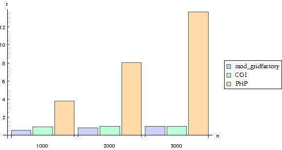
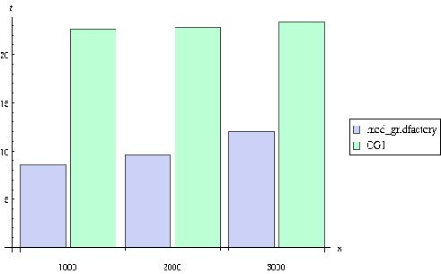
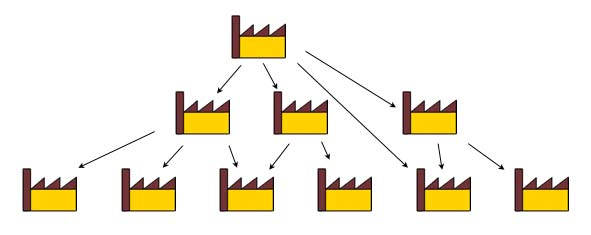
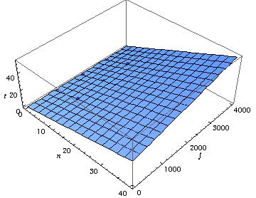

# 论文翻译

原文：[Distributed Computing with RESTful Web Services | IEEE Conference
Publication | IEEE Xplore](https://ieeexplore.ieee.org/document/6362956)

发布于：2012 年第七届 P2P 、并行、网格、云和互联网计算国际会议

DOI: `10.1109/3PGCIC.2012.30`

作者：

- Frederik Orellana（弗雷德里克 · 奥雷利亚纳，丹麦-哥本哈根-哥本哈根大学）
- Marko Niinimaki（马尔科 · 尼尼马基，日内瓦-西瑞士应用科技大学-HEPIA）

---

## Title

基于 RESTful 网络服务的分布式计算

## Abstract

在金融和科学领域，例如基因序列比对搜索、数据挖掘、图形渲染和蒙特卡罗模拟等高性能应用程序给计算机基础设施带来了越来越大的负担。以前，这种令人愉快的并行工作负载要通过标准的批处理调度来并行化，或者放大来看，基于网络服务的网格中间件，传统上依赖 SOAP 网络服务。有人认为， RESTful 网络服务为这种异步分布式计算提供了一个天然的框架，并容许一个更适合按需计算的体系结构。具体地描述了网格工厂/分布式计算系统的服务。这些服务以 Apache 模块的形式实现，利用 Apache api 进行访问控制和数据库通信。此外，标准 Apache 模块 `mod_dav` 和 `mod_ssl` 用于文件服务、身份验证和加密。描述了系统的特点，并对直接使用 Apache 作为托管平台的性能进行了评估。该系统已经过初步测试，证明了该方法的可行性。

> - [RESTful](https://en.wikipedia.org/wiki/Representational_state_transfer): Representational State Transfer，表现层状种万维网软件架构风格，目的是便于在不同软件/程序在网络（例如互联网）中互相传递信息。
> - [SOAP](https://en.wikipedia.org/wiki/SOAP): Simple Object Access Protocol，简单对象访问协议，一种交换数据的协议规范。
> - [Apache](https://en.wikipedia.org/wiki/Apache_HTTP_Server): Apache 基金会，这里特指 Apache HTTP Server，是 Apache 软件基金会中的一个开源网页服务器。

## Sec 1. 介绍及基本理论

GridFactory 是一个在局域网或广域网上聚合计算资源的系统，用于进行重负荷的批量计算。这种系统的目的是完成独立的、运行时间相对较长的作业，在某种程度上介于桌面网格（参考[1-3]）、传统的批处理系统和网格之间。它实现了一个分层的拉式架构，在链的末端有服务器从其他服务器中拉出计算作业，称为工作节点，从一个或多个服务器中拉出作业。系统的体系结构以及其实际用例的许多应用程序在[4]、[5]和 GridFactory 网站中都有文档说明。本文描述了该系统的网络服务。

建立这个系统的一个重要动机是公共云服务越来越受欢迎、规模越来越大，以及它们典型的使用模式: 由于在短时间内租用大量的机器和在较大的时间内租用同比例较少的机器所需要的费用是相同的，因此没有金钱上的理由不去用尽可能多的机器在尽可能短的时间内完成给定的一组任务。因此，在这样的环境中，批处理运行通常是在很多机器上完成的，它们的调度需要由一个快速且安全的系统来提供，而这个系统不一定要有很多调度特性，因为在一组同类机器上通常只有一个用户和一系列同类的任务。因此，对于优化最大完工时间和（或）流程时间的问题（例如[6]），往往采用先进先出的调度方式就可以得到解决。尽管如此，GridFactory 确实有一些简单的公平共享和非饥饿调度特性，如“性能评估”部分中所讨论的。另一个动机是大多数机构和企业进行大规模计算的可用计算资源的规模和多样性不断增加。这个想法是为了匹配桌面网格系统的可伸缩性、容错性和可部署性，允许在大规模上包含异构的、不可信的和易变的系统。所以，指导服务本身设计的一个原则是，这些服务应该是“傻”的——而客户端应该是智能的，因为执行简单任务的傻服务器更可能顺利地执行任务，出现错误的可能性更小，从而提高正常运行时间。此外，服务器会处于所有客户机（工作节点和作业提交者）的负载下，因此服务器上的 CPU 周期是一种宝贵的资源，最好不要将其花费在复杂的服务上。另一方面，对于空闲的客户机来说，CPU 周期这种资源将非常充足。这种考虑会导致有意识地避免在服务器上使用标准网络服务容器和 PHP 或 Perl 等高级语言。与此相反，每个 GridFactory 网络服务都是一个 Apache 模块[7]。

选择 Apache 模块，而不是从头开始编写多线程网络服务器的一个原因是后者是一项艰巨的任务。危险包括内存泄漏、安全漏洞（缓冲区溢出等）、性能和扩展等问题。通过“只”编写 Apache 模块，我们让 Apache HTTPD 完成了繁重的工作，并借助了 Apache api 提供的基础设施。最终的结果是需要维护的代码相对较少（约 4000 行 C 语言代码），提供系统特有的功能，而大多数从性能和安全角度来看至关重要的代码—— Apache HTTPD 和核心模块由全球开源社区开发者维护。

因为服务本身就很简单，所以不需要在网络上传递复杂的对象，因此也不需要进行传统的用于网格计算环境的 SOAP [8]信息交换。相反，我们发现使用简单的文本或 XML 对象的 HTTP PUT 和 GET 就足够了。这样，一个标准的网页浏览器，可以用来查询服务，同时人类也可以读懂查询的结果。

关于可部署性: 部署一个完整的 GridFactory 系统，既不需要重新配置防火墙（除了放行网络服务器的入站连接），也不需要设置共享用户帐户或网络文件系统。防火墙友好性是由于已经提到的拉式架构：与服务器的通信通常由客户机（工作节点或作业提交者）发起。这对调度有明显的影响，这部分将在“性能评估”一节中进行分析。

下面一节包含了相关工作的描述，然后是系统的网络服务的说明、在使用系统时这些服务如何发挥作用的描述（包括一个简单的例子），对体系结构的一些显著特征的讨论，最后是结论和展望。

> - [GridFactory](https://web.archive.org/web/20130131114502/http://www.gridfactory.org/ "Web Archive 快照，原域名已无法解析"): 是一个在局域网和广域网上集成计算资源以进行大规模计算的研究项目，通过虚拟化、集成软件目录和使用基于 x.509 的虚拟组织， GridFactory 旨在使加入、创建和使用分布式计算云变得简单。但是上面所说的网站的域名现在已经不能被解析了， Web Archive 上最后一次记录在 2013 年 1 月 31 日。
> - [CPU](https://en.wikipedia.org/wiki/Central_processing_unit): 中央处理器
> - [PHP](https://en.wikipedia.org/wiki/PHP): 一种脚本语言，一般嵌入 HTML 中用于网络开发
> - [Perl](https://en.wikipedia.org/wiki/Perl): 一种解释型、动态脚本语言。
> - [C 语言](https://en.wikipedia.org/wiki/C_%28programming_language%29): 一种通用编程语言，广泛用于系统、软件开发。
> - [Apache HTTPD](https://en.wikipedia.org/wiki/Apache_HTTP_Server): Apache 软件基金会的一个开源网页服务器。

## Sec 2. 相关研究

在像 Amazon EC2 这样的公共云上，部署标准的批处理调度系统是理所当然的，比如 PBS [9]、 GridEngine [10]和 Slurm [11]。这些系统采用推式架构，因此服务器需要事先知道节点的 IP 地址。这使得动态扩展需要依赖额外的服务和软件，变得极其困难，比如 StarCluster [12]、[13]、 CycleCloud 和 UniCloud。

在使用推式架构的动态设置中，一个特定的问题是需要让节点上的防火墙放行从服务器的 IP 地址入站的连接。最后变成了静态设置，因为这样为服务器提供了一个固定的 IP 地址。我们喜欢更动态的设置，使整个系统可以按需启动，比如说，启动一个服务器映像和任意数量的工作节点映像，它们仅需要知道服务器的 DNS 名称。尽管如此，从可用性或可部署性的角度来看，这个方法确实有一个小小的复杂性: GridFactory 需要服务器上与其 DNS 名称或 IP 地址匹配的 SSL 证书，但我们发现，使用像 DynDNS 这样的动态 DNS 服务会使这个复杂性变得可以接受——证书可以在每此部署时生成一次然后重复使用。

在动态云或桌面环境中，传统的批处理调度系统的另一个问题是，它们需要共享网络文件系统。一般使用 NFS 文件系统，但这导致了另一组复杂的问题和防火墙和安全隐患（需要运行更多的服务、需要在节点上打开更多的端口、数据流量没有加密），此外，由于负载很高，它并不能很好地扩展到数百个节点。因此，配置一个大型集群需要配置一个复杂的共享文件系统，要么通过多个 NFS 服务器，要么通过 GPFS 或 Lustre 等“高端的”网络文件系统，根据我们的判断，根据需要提供这些文件系统是不现实的。

以上提到的以及其他复杂的情况（比如对于无密码的 SSH 登录的需求）在某种程度上（至少在云环境中）都可以通过对节点和服务器映像进行充分的定制来解决，但总的来说，这种定制违背了我们的可部署性和安全性的目标。

正如前面提到的，GridFactory 与 BOINC 等桌面网格系统有几个共同的特点: 它允许在整个互联网范围内部署工作节点、内置了对工作节点故障的容忍、采用了拉式结构、工作节点非常容易部署。不幸的是，准备和提交作业并不那么简单，GridFactory 和 BOINC 之间的一个主要区别是，GridFactory 是一个通用的批处理系统，设置用户界面软件和提交作业并不比运行一个工作节点复杂。此外，GridFactory 实现了一个分层的拉式架构（即服务器可以从其他服务器拉取作业），并允许双向 SSL 身份验证和强加密。

名实相符，GridFactory 与 Globus [14]、 NorduGrid/ARC [15]和 gLite [16]等传统网格系统有许多共同特征。它们的两个主要区别是: 1）这些系统都使用所谓的 VOMS 代理证书[17]进行身份验证和授权，而 GridFactory 通过组成员[18]委托访问权限。2）这些系统是建立在批处理调度系统之上的，而 GridFactory 是一个批处理调度系统——具有广域网功能。3）采用拉式架构。与传统的网格软件栈相比，所有这些选择都意味着重大的架构简化。特别地，即使 GridFactory 可以部署在一个多站点的层次结构中，也可以避免复杂的集中调度[19]计算。从作业提交和调度的角度来看，多站点、分层的 GridFactory 部署在精神上类似于 GridWay [20]、[21]和 ARC，因为用户可以选择在哪里运行作业，并希望在层次结构中靠近自己运行作业。另一方面，他也可以选择通过提交到层次结构更高的服务器上实现的更集中的多站点调度，以及通过提交到顶级服务器上实现更常见的完全集中的调度[22]，[23]。

一个在精神上类似于 GridFactory 的系统是 Condor [24]。可用性观点的主要区别在于部署和安全模型。Condor 支持在服务器和工作节点上运行的多个网络守护进程，并且拥有一个复杂的安全基础设施和许多选项，包括很多可能用到的身份验证方法（SSL、Kerberos、密码、……)，而 GridFactory 只支持 SSL ，而且由于服务器上唯一的网络守护进程是 Apache HTTPD，因此配置要简单得多。从技术角度来看，Condor 是一个老项目，所有组件都从头开始编写，并使用自己的协议进行信息交换。这个说法并没有任何消极的意义，因为 Condor 已经不断发展了很多年，它的性能已经被很好地证明了。相比之下，GridFactory 是一个全新的、相对来说缺少验证的尝试，它利用现代的、开源的、标准的网络技术构建一个分布式计算系统。

XtremWeb [25]和它的 `p2p-sibling`，`XtremWeb-ch` [26]是一个更像 GridFactory 的系统。这些系统实现了一个拉式架构，工作节点守护进程与 GridFactory 中的守护进程一样，是用 Java 实现的。与 GridFactory 不同，它们使用非标准的通信协议，不允许分层部署。

DIRAC [27]系统和 AliEN [28]系统都是欧洲核子研究中心开发的，而且都是基于拉式架构的，它们可能是最类似于 GridFactory 的两个系统。用[27]的术语来说它们架构上的主要差异在于 GridFactory 是一个基于拉式架构的全局计算系统，而 DIRAC 和 AliEN 都是混合网格（全局）计算系统，在本地“推式”调度系统之上提供了一个“拉式”作业分配层。此外，这些系统都与上述传统网格系统集成。这两种差异在复杂性和可部署性方面都有影响。

另一个分布式计算系统是非常流行的 Hadoop [29]。Hadoop 并不是一个通用的批处理调度系统，而是一组库，实现 MapReduce [30]编程模型。它类似于 GridFactory，在这个意义上，数据分布是半自动处理的，数据是在有物理上可用的（数据局部性）数据的节点上处理的，但与 GridFactory 相比，Hadoop 本质上是一个局域系统，网络安全性很低，数据分布基于分散式文件系统。此外，在合并和减少作业输出方面，Hadoop 具有 GridFactory 所缺少的智能。然而，为了利用这一点，作业和应用程序必须使用提供的 JAVA API 专门制作。有了 Hadoop 流实用工具，就可以像使用“傻”批处理系统一样使用 Hadoop 来处理独立的作业，但是对作业进行精雕细琢并非易事，甚至具有挑战性，尤其是在处理二进制数据[31]时。虽然还有其他一些 MapReduce 实现在一定程度上解决了这个问题，但是没有一个能达到 Hadoop 的普遍性。

> - [Amazon EC2](https://en.wikipedia.org/wiki/Amazon_Elastic_Compute_Cloud): 亚马逊弹性云计算，是亚马逊公司提供的一个网络服务，允许用户租用云端电脑运行所需的应用。
> - PBS,GridEngine,Slurm,StarCluster,CycleCloud,UniCloud: 一些计算机集群软件。
> - [Condor](https://en.wikipedia.org/wiki/HTCondor): HTCondor，是一个开源的高吞吐量计算软件框架，用于计算密集型任务的粗粒度分布式并行化。
> - [JAVA](https://en.wikipedia.org/wiki/Java_%28programming_language%29): 一种编程语言。
> - [Hadoop](https://en.wikipedia.org/wiki/Apache_Hadoop): Apache 基金会的一个支持数据密集型分布式应用程序的开源软件框架。
> - [MapReduce](https://en.wikipedia.org/wiki/MapReduce): Google 提出的一个软件架构，用于大规模数据集的并行运算。

## Sec 3. 网络服务概述

### 文件服务器

GridFactory 依赖于一个安全的 WebDAV 文件服务器，这个文件服务器由 Apache HTTPD 及其核心模块外加 `mod_dav` 和 `mod_ssl` 标准模块提供。默认情况下，通信是经过加密的并且有双向身份验证，因此所有节点（服务器和个人）必须具备公共 x.509 证书和对应的密钥[32]。访问控制是基于组（虚拟组织）的成员身份的。每个节点都以其公共证书的专有名称注册在组中。

也就是说，以一种不安全的方式运行系统是可以的。如果客户机（提交作业的客户端或工作节点的守护进程）没有找到任何已安装的证书，它就会尝试使用默认的测试证书——服务器可能允许也可能不允许。

技术上来说，控制服务器上的给定目录是否可以访问的方法是把“ `.gacl` ”文件放在目录中，这个文件需要以 GACL XML 格式[33]编写，然后由自定义编写的 Apache 模块 `mod_gacl` 授予访问权限。原则上，除了客户端证书和其他识别码以外，还可以使用其他凭证和其他识别码，例如传统的用户名和密码。这样做需要通过 `mod_ssl` 以外的方式设置 `SSL_CLIENT_S_DN` 环境变量。

### 数据库

每个计算作业都作为一条记录保存到 MySQL 数据库中。工作节点则通过 Apache 模块 `mod_gridfactory` 实现的 RESTful [34] 网络服务与该数据库进行交互。

对数据库的访问也是通过 GACL 控制的。 `mod_gacl` 接受一个指示符： `GACLRoot` ，该指令用于指定检查“ `.Gacl` ”文件时使用的备用路径。这意味着访问类似“ `https://my.server/db/jobs/` ”的 URI 的权限是由“ `[GACLRoot]/db/jobs/.geal` ”文件控制的。

[35]详细描述了数据库表的模式和提供对这些表的访问的网络服务。

### 软件结构

作业请求的以及工作节点下载安装的软件包被注册在一个 XML 软件结构文件中。这个目录只提供“原样”的服务，即提交作业的客户端和工作节点从文件服务器下载的 XML 文件。该文件包含实际软件包 url 的条目用于下载。

GridFactory 服务器可以订阅外部软件目录，并且可以通过配置下载和缓存外部软件包。

### 作业的生命周期


在 GridFactory 上执行作业意味着一个工作流，如图 1 所示，提交者和工作节点都与服务器上的 web 服务进行交互（上图中的工厂）。下面概述一下这方面的概念。

### 作业的描述

每个计算作业都通过数据库表“ jobDescription ”中的一条记录进行描述。这样的每条记录包含工作节点的信息、下载输入和上传输出的文件位置、作业的当前状态、作业的要求等等。作业描述记录的所有字段都由网络服务公开。由网络服务返回的作业记录作为与表的字段对应的选项卡分隔的值行，加上与服务添加的额外字段“ dbUrl ”对应的值。最后一个字段“ dbUrl ”表示从工作节点看到的单个作业的 URL ，即服务器上可以获取特定作业信息的 URL 。由于作业可能已经直接提交到了服务器，或者服务器可能已经从另一台服务器上将其取出，所以不要将“ dbUrl ”与“ identifier ”混淆，“ identifier ”是作业最初提交到的 URL 。

### 作业的提交

提交一项作业的步骤有：在服务器上的假脱机作业目录中创建一个目录，上传输入文件，然后在这个目录中创建一个名为“ job ”的文件。字符串目录名由提交者决定，目录的完整 URL 则是作业的唯一标识符。 GridFactory 附带的提交工具将会生成一个基于时间的唯一标识符，但是原则上可以使用任何字符串。“ job ”文件包含指令，描述输入和输出文件、可执行文件等。服务器上的守护进程则以固定的间隔扫描假脱机目录，当找到新作业时，它会解析“ job ”文件中的这些指令，并在“ jobDescription ”数据库表中创建相应的记录（详细信息请参阅[35]）。

### 作业的执行

作业由工作节点拾取：每个节点运行一个守护进程，定期扫描服务器上的作业数据库表。当守护进程发现一个新的作业时，它从服务器下载输入文件，按照需要或要求（来自作业、服务器或它自己的配置）启动虚拟机，安装依赖的软件包，执行作业并上传输出文件。在此类事件发生期间，工作节点守护进程定期向数据库更新作业状态信息。

### 作业的查询和处理

一旦作业提交后，作业记录中唯一可由提交者或工作节点修改的字段是状态字段。通过修改这个字段，提交者可以控制工作节点守护进程关闭、暂停或恢复作业，或者将作业当前的标准输出和标准错误上传到服务器，以便于从服务器中下载这些信息。修改此字段还允许工作节点请求作业并报告其状态。

作业记录的修改使用 HTTP PUT 完成，并且每次执行 HTTP PUT 后 “ lastModified ”值都会变更，这与作业记录是否实际更改无关。不允许使用 HTTP PUT 创建新的作业记录，如果执行这种操作，服务器将返回“ 404 Not Found ”错误。

### 作业的历史

有一个用于保存关于已接受的作业的信息的单独的数据库表“ jobHistory ”。此表包含与“ jobInformation ”表相同的字段和包含作业所经历的状态更改的记录的额外的字段“ csStatusHistory ”。

### 作业的一个具体的例子

一个网络服务交互的简单示例：考虑一个脚本“ convert.sh ”。这个脚本将一个文件从一种格式转换成另一种格式，比如像这样：

```plain
convert.sh [input file] [output file]
```

假设我们想使用这个脚本来转换多个文件：“ file1.in ”，“ file2.in ”，“ file3.in ”……，一种方法是使用图形化客户端 GridPilot ，它附带了许多此类示例。另一个选择是为 GridFactory 的命令行应用程序编写脚本。例如一个 Linux 上的 Bash shell 脚本：

```shell
echo "./convert.sh *.in" > myscript.sh
for name in `ls *.in` do; psub -b
my_server \
-e myscript.sh -i $name -o $name.out;
done
```

提交后可以通过以下方式查看作业状态：

```shell
for id in \
`pget -b my_server| grep https |
awk'{print $1}'` do;\
pget $id; done
```

上面的代码，使用了一些 GridFactory 命令： psub 、 pstat 和 pget 。从名称的选择中可以看出， GridFactory 的命令行界面和标准的批处理系统非常相似。

> - [WebDAV](https://en.wikipedia.org/wiki/WebDAV): 基于网络的分布式编写和版本控制，是超文本传输协议的扩展，有利于用户间协同编辑和管理存储在网络服务器里的文档。
> - [SPOOL](https://en.wikipedia.org/wiki/Spooling): Simultaneous Peripheral Operations On-line，假脱机（外部设备联机并行操作）是一种数据缓冲，指传输数据的过程中，将数据存放在临时工作区中。

## Sec 4. 性能评估

### 网络服务基本测试

通过比较 PHP 程序、 C 语言编写的 CGI 程序与 `mod_gridfactory` 的数据库查询速度作比较，测试了作业查询网络服务的性能。这个基准测试使用了一个相对较老的服务器（ Pentium 4 处理器，2.6 GHz CPU ，500mb RAM ，100mb/s 网卡）通过 40mb/s 的网线完成查询。图 2 显示了每种方法返回 1000 、 2000 和 3000 条记录的单个查询耗时。由于格式不同，返回的数据量不完全相同：分别为 296 、 224 和 125 kB 。图 3 显示了由 10 个线程并行执行相同查询的计时（以最后一个线程完成的时间为基准）。尽管 `mod_gridfactory` 返回的数据量略大（因为它增加了一个“虚拟”列），但对于单个查询，它比直接进行单个查询的 CGI C 程序快、比 PHP 快得多。对于并行查询（这里以 10 个线程为例），它还是比 CGI C 程序快得多、可能也比 PHP 快得多（未经测试）。





总之，我们的自定义 Apache 模块比通过 CGL Performance 直接调用 C 程序快得多，还可以通过标准的 Apache 服务器调优得到增强。我们认为这一点很重要。

### 容错能力



GridFactory 的设计初衷是能够运用不稳定的资源，如台式电脑或笔记本电脑。这些资源可能会在某个时期离线，或者彻底消失。因此，资源注册不是在服务器上手动完成的，而是由每个工作节点本身自动完成的。数据库的“ nodeInformation ”表用于保存关于当前从服务器中提取作业的工作节点的信息。这些信息包括可用的 RAM 和已安装的虚拟化管理系统。如果在配置的时间（默认为 60 分钟）内没有更新记录，服务器则会认为工作节点已关闭、删除该记录。对于在“ jobInformation ”中注册了的作业，有一个类似的策略实现：运行作业的工作节点将定期在数据库中将作业标记为“ alive ”。如果作业没有在配置的时间（默认为 60 秒）内更新自己的状态，则将被视为丢失，并被重新安排给其他工作节点（只需要把作业重置为“就绪”状态）。因此，使用默认配置，完成作业后进入就绪状态的工作节点在被服务器从记录表中删除之前很长一段时间就已经在其他地方重新安排了作业。

### 可扩展性

GridFactory 服务器可以以独立模式运行，同时也可以配置成如图 4 所示的层次结构: 每个服务器可以从一个或多个其他服务器中取出作业和软件。可以配置工作节点从多个服务器获取数据，对于提交作业的客户端也是如此：可以配置这些工作节点向多个服务器进行轮询。这允许对故障的服务器的情况进行容错，也允许部署具有完全不同特性的拓扑结构以及原则上的水平可伸缩性。

要评估每个服务器原则上可以服务的工作节点数，可以假设从发出作业查询到收到完整回应的时间可以用以下公式进行线性建模

```tex
t(j,n)={sjn\over w}+aj+bn+c,
```

这个公式中 s 是每个记录返回的的大小，单位字节、 j 是每次查询返回的记录的数量， n 是节点的数量。用下面的数据和我们得到的数据进行拟合：

```tex
\eqalignno{ & \quad a=0.0000509111\, s, b=0.689122\, s,\cr & c=-0.344756\, s, w=1.74867\, 10^{6}\, B/s,}
```

标准差为 0.25 秒，结果绘制在图 5 中。



显然，这是一个非常粗略的近似值，但它为我们提供了一个关于 Pentium 4 服务器可以提供什么程度的服务的实践准则：例如，如果同时让 40 个节点完成 400 个作业，那么响应时间为 30 秒（工作节点的默认查询周期）。对于更多的节点或更多的作业，如果所有节点在某个时刻都没有启动了的作业，则服务器将超载。系统可以优雅地解决这个问题: 根据 Apache 配置，请求会被放进队列进行处理，最后得到响应或超时——也就是说，初始响应时间将会增加。工作节点具有内置的超时重试和服务器无响应时的备份策略: 如果查询超时，则拉取作业的间隔将加倍，并在可配置的时间内保持这种方式。一旦节点拿了足够多的作业来填补它们的空位，它们就会停止向服务器查询新的作业，只更新它们自己的作业。此时，服务器的负载将会降低，响应速度将会变快。对于现代硬件，我们显然期望服务器能够容纳更多的工作节点，例如使用四核处理器和吉比特以太网，如果操作没有问题，服务器至少可以容纳 160 个节点（通常相当于 1280 个处理器核）。此外，随着服务器数量的增加，系统的平均规模和准线性规模随之增大。对预期性能进行更详细的估计，需要对作业调度建模并进行模拟。在[27]中， Caron 等人描述了他们为另一个基于拉式架构的系统实现的模拟器，在接下来的内容中，我们将用这个模拟器来证明我们基于拉式架构的调度方法的优点。

### 调度特性

GridFactory 作业的优先顺序策略可以描述为先到先服务和最短作业优先的探索性混合体：首先服务器提供可用作业列表，按提交时间排序。然后可以配置每个工作节点随机排序并选择第一个可运行的作业，或者根据权重 `q/r` 对作业进行优先级排序，其中 `q` 是作业在服务器上排队的时间， `r` 是请求的 CPU 时间。使用第二种方法，短期作业将会被优先处理，这样避免了作业饥饿。服务器强制执行公平共享政策：如果设置了公平共享 CPU 百分比，服务器就会阻止工作节点在达到其限制时接收特定组或个人的作业。为了避免资源衰竭，如果唯一可用的作业是由已经达到或超过其份额的团体或个人提供的，这项政策就不会强制执行。

本节讨论的问题是，这种方式与常规的基于推式架构的调度方式相比性能如何。传统上，调度系统的特征是最大完工时间和流程时间，其定义如下：

```tex
\eqalignno{ T_{makespan}& =\mathop{max}\limits_{i\in\{1,..,n\}}T_{j_{i}},\cr T_{flow}& =\sum_{i=1}^{n}T_{j_{i}},}
```

其中 `J=\{j_{1},...,j_{n}\}` 是所有 n 个作业的集合， `T_{j_{i}}` 表示作业完成的时间。一个调度 `S=\{S_{1},...,S_{k}\}` 是由一个 `\{1,...,n\}` 分裂成有的序子集，每个子集都会从集合 `M=\{m^{1},...,m^{k}\}` 被分配给一台机器。因此，对于 10 个作业和 3 台机器的情况， s 看起来像：

```tex
S=\{\{1,3,5\},\{2,4,6\},\{7,8,9,10\}\}.
```

每个调度方案的选择将确定 `T_{j_{i}}` 的值，从而确定最大完工时间和流程时间。如果我们将机器的完成时间 `t_{m^{i}}` 定义为机器完成所有分配了的任务的时间，则完成时间和流程时间可以表示为：

```tex
\eqalignno{ & T_{makespan}=\mathop{max}\limits_{i\in\{1,..,k\}}t_{m^{i}},\cr & \qquad T_{flow}=\sum\limits_{i=1}^{k}t_{m^{i}}}
```

机器完成时间还允许定义另一个有趣的参数，即平均资源利用率 r ：

```tex
r={1\over k}\sum_{i=1}^{k}{t_{m^{i}}\over T_{makespan}}={T_{flow}\over kT_{makespan}}.
```

调度程序通常选择最小化 `T_{makespan}` 和 `T_{flow}` 或最大化平均资源利用率的计划 S 。为此，调度程序需要了解每个节点的情况：哪些作业可以在何处、以何种速度运行。 ETC 模型（估计完成时间）通过将机器完成时间表示为：

```tex
t_{m_{i}}=\sum\limits_{a\in S^{j}}\Theta_{a}^{i},
```

这里 `\Theta^{i}_{a}` 是在机器上执行任务所需要的时间。最大完工时间和流程时间可以表示为：

```tex
\eqalignno{ T_{makespan}& =\mathop{max}\limits_{i\in\{1,..,k\}}\sum_{a\in S^{j}}\Theta^{i}_{a},\cr T_{flow}& =\sum_{i=1}^{k}\sum_{a\in S^{j}}\Theta_{a}^{i}}
```

采用均匀 ETC 矩阵 `\Theta` 的话流程时间并不依赖于调度，最小化最大完工时间也变得微不足道。例如，对于上面的例子来说，选择的时间表是一种可能性。

在拉式系统中，在作业执行之前，系统不会为一批作业选择 `S` ，而是一直构造到底。在[27]中，我们将这种策略的平均作业等待时间与一般的推送策略进行了比较，一般的结论是，如果获取节点状态信息的平均延迟为零，使用推式是最好的，但是随着延迟变高，使用拉式相对更好。具体而言，他们发现在有 60 个插槽非同质节点上有 500 个任务时，如果获取节点状态的平均延迟小于 95 秒，推式会更好。对于延迟较高的情况，拉式会更好，例如在延迟为 260 秒的情况，拉式会比集中的推式略微差一点（10%）。因此，在具有高延迟的现实情况下，与推式调度策略相比，拉式调度策略似乎是等待时间最小化、完工时间和流程时间最大化的最佳选择。

## Sec 5. 总结和展望

GridFactory 的目的是使在不稳定和异构的资源之外构建计算集群成为可能，并且其设计特别考虑了可用性和可部署性，这也是选择拉式架构的原因。

这种架构的一个挑战是网络服务的持续负载，因为工作节点会不断地进行查询，因此这些服务必须快速可靠地执行。由于这些原因，服务使用 Apache 模块实现，避免了标准的 SOAP 网络服务和应用服务器中间件。客户端直接通过 HTTP PUT 、 GET 与服务器进行通信，网络服务本身非常简单。作业检索服务的性能与通过 CGI 调用的简单 C 程序和 PHP 程序的性能进行了比较。 Apache 模块的速度明显快于两者——尤其是在处理多个并发请求时。我们估计，在现代硬件上， GridFactory 服务器可以容纳超过 160 个工作节点完成一些不太短的作业（每个作业使用 CPU 的时间大于 10 分钟）。此外，只需添加更多的服务器，就可以水平扩展系统。我们打算在实践中验证这一点。

另一个挑战是优化调度策略。文献指出：如果在服务器端获取工作节点状态具有高延迟的话，拉式调度通常是集中式推式调度的一个很好的替代方案。这正是 GridFactory 所针对的情况。

也就是说，我们强调发明 GridFactory 的主要动机是减少在现实世界、随需应变和效用计算环境中配置和扩展系统的麻烦。在这样的环境中，通常无法获得有关 CPU 频率、可用 RAM 、已安装的软件等的详细且最新的信息。其实实际上情况比这更糟糕，因为可能存在“干扰”，即不同或不可预测的性能，由于事实上，在云或桌面节点上，它们不一定是孤立的。

特别值得注意的是，该系统是完全独立的，即建立一个完整的计算机集群，而不需要额外的软件和服务（如网络文件系统、普通用户帐户、无密码登录等）是可能的。

该系统已经在各种科研应用程序和一般的应用程序上进行了测试（如文献[4]所述）。到目前为止，我们还没有观察到任何扩展性问题——例如，在一次课堂练习中，有 32 个工作节点和 64 个作业提交者，运行在标准桌面硬件（ Intel i5 处理器和 4GB RAM ）上的一个 Linux 服务器一直保持着非常高的响应性。

我们还计划以后对系统进行更广泛和专门的性能测试。
