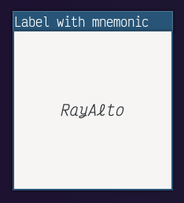

# 一些常见的组件

Gtkmm 自带了很多组件

1. [按钮类](#按钮类)
   1. [开关按钮 `Gtk::ToggleButton`](#开关按钮-gtktogglebutton-)
   1. [多选按钮 `Gtk::CheckButton`](#多选按钮-gtkcheckbutton-)
1. [范围类](#范围类)
   1. [比例组件 `Gtk::Scale`](#比例组件-gtkscale-)
   1. [滚动条 `Gtk::Scrollbar`](#滚动条-gtkscrollbar-)
1. [杂项](#杂项)
   1. [标签 `Gtk::Label`](#标签-gtklabel-)
   1. [条目 `Gtk::Entry`](#条目-gtkentry-)
   1. [微调按钮 `Gtk::SpinButton`](#微调按钮-gtkspinbutton-)
   1. [进度条 `Gtk::ProgressBar`](#进度条-gtkprogressbar-)
   1. [信息栏 `Gtk::InfoBar`](#信息栏-gtkinfobar-)
   1. [提示框 `Gtk::Tooltip`](#提示框-gtktooltip-)
1. [容器组件](#容器组件)
   1. [单项容器](#单项容器)
      1. [框架](#框架-gtkframe-)
      1. [窗格](#窗格-gtkpaned-)
      1. [滚动窗口](#滚动窗口-gtkscrolledwindow-)
      1. [扩展器](#扩展器-gtkexpander-)
   1. [多项容器](#多项容器)
      1. [盒子](#盒子-gtkbox-)
      1. [网格](#网格-gtkgrid-)
      1. [笔记本](#笔记本-gtknotebook-)
      1. [助手](#助手-gtkassistant-)
      1. [动作条](#动作条-gtkactionbar-)
      1. [流式盒](#流式盒-gtkflowbox-)
      1. [图标视图](#图标视图-gtkiconview-)
1. [树形视图](#树形视图-gtktreeview-)
   1. [定义数据模型](#定义数据模型)
      1. [模型列](#模型列-gtktreemodelcolumnrecord-)
      1. [存储列表](#存储列表-gtkliststore-)
      1. [存储树](#存储树-gtktreestore-)
      1. [添加行](#添加行)
      1. [添加子行](#添加子行)
      1. [设置值 & 获取值](#1)
   1. [使用模型](#使用模型)
      1. [在一个视图列里面塞多个模型列](#在一个视图列里面塞多个模型列)
      1. [可编辑的单元格](#可编辑的单元格)
      1. [遍历模型行](#遍历模型行)

## 按钮类

### 开关按钮( `Gtk::ToggleButton` )

跟普通的按钮差不多，但是可以通过 `bool get_active()` 获取按钮的状态（有没有被按下），按下后会有按下的效果：


### 多选按钮( `Gtk::CheckButton` )

跟开关按钮差不多，默认情况下只有外观不同，带有一个"☑️"，不能像普通按钮一样 `set_child()`


Gtkmm 4 好像删除了 `Gtk::RadioButton` ，但是 `Gtk::CheckButton` 可以通过 `set_group()` 变成类似单选按钮的组件


## 范围类

### 比例组件( `Gtk::Scale` )

像音量条一样的东西，拖动的时候会触发 `signal_value_changed()` 信号

构造函数里需要传一个 `Gtk::Adjustment` 指针，可以用 `Gtk::Adjustment::create(value, lower, upper, step_increment, page_increment, page_size)` 创建，还可以再传一个 `Gtk::Orientation` 进去设置这个条是横向的还是纵向的。


如果我没记错的话 Gtkmm 3 的时候这个东西是默认有数值显示的，现在可以手动打开，还可以设置数值的位置

```c++
scale_.set_value_pos(Gtk::Position::LEFT);
scale_.set_draw_value();
```


还可以把值的大小反过来，拉到头得到的值反而最小：

```c++
scale_.set_inverted();
```


### 滚动条( `Gtk::Scrollbar` )

标准的滚动条，只能用于滚动其他组件，但如果要滚动其他组件的话通常情况下用 `Gtk::ScrolledWindow` 更简单一些


## 杂项

### 标签( `Gtk::Label` )

普通的标签已经在[这里](./01.带图片的按钮.md)展示过了（嵌在按钮里了），还可以打开助记符（ mnemonic ），在想要加助记符的字符前面加上 `_` 就可以了，按下 `Alt` 的时候助记符会显示为下划线样式：

```c++
Gtk::Label label("_Label wi_th mnemoni_c", /* mnemonic */ true);
```


默认情况下标签不能折行，也就是说标签的最小宽度就是标签里的字符的宽度，用 `set_wrap()` 可以启用折行。启用折行后默认情况下文本是左对齐的，可以通过 `set_justify()` 来设置对齐方式：


还可以使用 [Pango 标记语法](https://docs.gtk.org/Pango/pango_markup.html)，需要 `set_use_markup()` 或 `set_markup()` ，比如：

```c++
Gtk::Label label(R"+*+*(<span font="Victor Mono 16" font_style="italic">RayAlto</span>)+*+*");
label.set_use_markup();
```



### 条目( `Gtk::Entry` )

用户可以在里面输入文字， `set_text()` 和 `get_text()` 可以对条目里的文字进行操作：


可以 `set_editable()` 设置条目是否可编辑，这里用默认的主题好像外观没有明显的变化， `set_visibility()` 可以决定条目是不是像密码框一样的外观（字符全用 `*` 挡住）：


还可以设置补全，但是过程非常麻烦，首先你需要自己定义一个 Model ，比如只有 `id` 和 `name` 两列这样：

```c++
#include "glibmm/ustring.h"
#include "gtkmm/treemodelcolumn.h"

class CompletionModelColumns : public Gtk::TreeModel::ColumnRecord {
public:
    CompletionModelColumns() {
        add(column_id);
        add(column_name);
    }

    Gtk::TreeModelColumn<unsigned int> column_id;
    Gtk::TreeModelColumn<Glib::ustring> column_name;
};
```

然后像这样把数据塞进去：

```c++
#include "glibmm/refptr.h"
#include "gtkmm/entrycompletion.h"
#include "gtkmm/liststore.h"
#include "gtkmm/treeiter.h"

// ...

Glib::RefPtr<Gtk::EntryCompletion> completion =
    Gtk::EntryCompletion::create();
// CompletionModelColumns completion_model_columns_;
Glib::RefPtr<Gtk::ListStore> completion_model =
    Gtk::ListStore::create(completion_model_columns_);
Gtk::TreeRow row = *(completion_model->append());
row[completion_model_columns_.column_id] = 1;
row[completion_model_columns_.column_name] = "你是一个一个一个";
row = *(completion_model->append());
row[completion_model_columns_.column_id] = 2;
row[completion_model_columns_.column_name] = "举办永雏塔菲喵";
row = *(completion_model->append());
row[completion_model_columns_.column_id] = 3;
row[completion_model_columns_.column_name] = "举办永雏塔菲谢谢喵";
row = *(completion_model->append());
row[completion_model_columns_.column_id] = 4;
row[completion_model_columns_.column_name] = "114514";
row = *(completion_model->append());
row[completion_model_columns_.column_id] = 5;
row[completion_model_columns_.column_name] = "1919810";
completion->set_model(completion_model);
completion->set_text_column(completion_model_columns_.column_name);
// Gtk::Entry entry_;
entry_.set_completion(completion);
```

然后就有补全了：

> 30 多行代码添加了 5 个补全， real nice


还可以 `set_icon_from_pixbuf()` 或 `set_icon_from_icon_name()` 给条目设置图标，图标默认在左边，可以传第二个参数 `Gtk::Entry::IconPosition::SECONDARY` 让图标在右边，条目的图标被按下/释放时会触发 `signal_icon_press()` 和 `signal_icon_release()`

```c++
entry_.set_icon_from_icon_name("edit-find");
```


还可以 `set_progress_fraction(double)` 设置一个进度提示，比如这里设置 10 个字符可以填满进度条：

```c++
entry_.signal_changed().connect([&]() -> void {
    entry_.set_progress_fraction(entry_.get_text_length() / 10.0);
});
```


### 微调按钮( `Gtk::SpinButton` )

外观来看就是条目组件右边加了一个加号和一个减号用来调整里面的值：


可以在构造函数里传一个 `Gtk::Adjustment` ，参数分别为：

- `value`：微调按钮的值
- `lower`：微调按钮允许的最小值
- `upper`：微调按钮允许的最大值
- `step_increment`：鼠标键 1（通常是左键）点击一下递增/递减的值
- `page_increment`：鼠标键 2（通常是右键，但我的 Logi M590 是中键）点击一下递增/递减的值
- `page_size`：目前没作用

也可以默认构造 `Gtk::SpinButton` 后通过 `get_adjustmemt()` 获取 `Gtk::Adjustment` 指针，然后调整里面的值（这时设置 `value` 不会生效了，想要设置的话可以使用 `Gtk::SpinButton::set_value` ）

还有，鼠标键 3（通常是中键，但我的 Logi M590 是右键）点加号/减号可以直接跳转到最大值/最小值

`double get_value()` 可以获取到值，而且是浮点，但不知道默认情况下里面可以输入非数字字符， `set_numeric()` 可以拒绝非数字字符，不懂 Gtk 为什么这么设计；默认情况下好像不会显示小数点后的数字，可以通过 `set_digits()` 设置显示小数点后几位

`set_wrap()` 可以让数值达到最大值/最小值的时候重新绕回最小值/最大值

`set_snap_to_ticks()` 可以限制数值在 `step_increment` 可以达到的范围，比如设置 `step_increment` 为 `5` ，那么输入 `9` 之后会被修正为 `10`

数值改变后会触发 `Gtk::SpinButton::signal_value_changed()` 或 `Gtk::Adjustment::signal_value_changed()`

### 进度条( `Gtk::ProgressBar` )

> 定时器的用法见[这里](./03.实用工具.md#定时器)

顾名思义是个进度条，但这个进度条不得了，它不光能表示进度，还能表示任务正在运行（进度无法确定），下面展示表示进度的进度条（用定时器模拟进度）：

- `set_fraction()` 用来设置进度（ `double` 类型，从 `0.0` 到 `1.0` )
- `get_fraction()` 可以获取当前的进度值

```c++
Gtk::ProgressBar progress_bar;

// ...

sigc::connection timer = Glib::signal_timeout().connect(
    [&]() -> bool {
        double current_fraction = progress_bar.get_fraction();
        if (current_fraction < 1.0) {
            progress_bar.set_fraction(current_fraction + 0.01);
        }
        else {
            progress_bar.set_fraction(0.0);
        }
        return true;
    },
    20);
```


下面展示表示任务正在运行（进度无法确定）的进度条

- `set_pulse_step()` 可以设置每次小方块移动的距离
- `pulse()` 可以触发一次小方块的移动

```c++
Gtk::ProgressBar progress_bar;

// ...

sigc::connection timer = Glib::signal_timeout().connect(
    [&]() -> bool {
        progress_bar.pulse();
        return true;
    },
    20);
```


还可以使用 `set_show_text()` 显示 `set_text()` 的文字：


### 信息栏( `Gtk::InfoBar` )

在一个地方显示一些简短信息，是一个组件， API 与 `Gtk::Dialog` 十分相似

- `set_message_type(Gtk::MessageType)` 可以设置消息类型，但默认主题好像外观上没什么区别
- `add_child()` 可以添加任何子组件，例如标签
- `add_button(const Glib::ustring& button_text, int response_id)` 可以添加按钮，这里设置的 `id` 与回调的参数对应
- 单击通过 `add_button()` 添加的按钮会触发 `signal_response()` ，回调有一个参数为被单击的按钮的 `response_id`
- 默认情况下添加 `Gtk::InfoBar` 会直接显示，如果不需要可以 `hide()` 然后需要的时候 `show()` ，也可以在回调里满足条件的情况下调用 `hide()` “关掉”信息栏


### 提示框( `Gtk::Tooltip` )

据说任何组件都可以通过 `set_tooltip_text()` 或 `set_tooltip_markup()` 设置提示文本（仅限文本）


据说任何组件都可以通过 `signal_query_tooltip()` 实现更复杂的提示框，回调的最后一个参数是一个 `Gtk::Tooltip` 的指针，可以通过 `set_markup()` ， `set_icon()` ， `set_custom()` （这个甚至可以传一整个 `Widget` 进去）等方法定义更复杂的提示框

- 回调的前两个参数是相对父组件的坐标，第三个参数表示这个信号是不是键盘发出的，如果是的话坐标参数就没有意义了，不要使用

> 这种情况下需要 `set_has_tooltip()` 来告诉组件自己有提示框，组件才能正确发出 `signal_query_tooltip()` 信号


## 容器组件

Gtk 提供了很多容器组件，其中有一些可以容纳很多子组件，还有一些只能容纳一个子组件

### 单项容器

只能容纳一个子组件（这个子组件可以是一个包含了很多子组件的多项容器），可以通过 `set_child()` 设置子组件，也可以 `unset_child()` ，上面经常用到的 `Gtk::Button` 和 `Gtk::Window` 从技术上来说就是单项容器，下面就不再讲了

#### 框架( `Gtk::Frame` )

就是一个框框加一个标签，可以用 `set_label()` 设置标签内容 `set_label_align(Gtk::Align)` 设置标签文本对齐方式：


#### 窗格( `Gtk::Paned` )

分成上下两半的容器，所以只能装两个子组件，而且设置方式是 `set_start_child()` ， `set_end_child()`

- 构造函数可以传一个 `Gtk::Orientation` 或 `set_orientation(Gtk::Orientation` 可以设置是上下分开还是左右分开
- `set_position()` 可以设置分隔线的位置，单位为像素，负值表示不设置分隔线位置


#### 滚动窗口( `Gtk::ScrolledWindow` )

虽然名字里有一个 window 但它只是一个可以塞在任何地方的容器，空间不能完整地显示子组件时它会有两个滚动条，可以通过 `set_policy(Gtk::PolicyType, Gtk::PolicyType)` 分别设置水平、垂直方向上滚动条出现的规则：

- `Gtk::PolicyType::ALWAYS` 总是显示
- `Gtk::PolicyType::AUTOMATIC` 智能显示


#### 扩展器( `Gtk::Expander` )

就是一个能收起来的组件：

- `set_expanded` 可以设置是否展开


还可以 `set_label` 设置一个标签：


### 多项容器

顾名思义能装很多子组件的容器，不同的多项容器设置子组件的方式也有所不同。

#### 盒子( `Gtk::Box` )

前面其实已经用过这个容器好多次了，就是一种流式布局，可以横向或纵向。

- `append` 和 `remove` 可以添加或删除子组件。
- 可以在构造函数里第一个参数或 `set_orientation` 设置 `Gtk::Orientation`
- 可以在构造函数里第二个参数或 `set_spacing` 设置子组件间的间距
- `set_homogeneous` 可以设置所有子组件大小相同
- `set_align` 可以设置对齐方式，比如 `Gtk::Align::CENTER` 或 `Gtk::Align::FILL`

> 和 HTML 的流式布局不同的是这个东西好像不能折行。使用时可能需要注意一下是不是需要给 `Gtk::Box::set_expand` 让盒子充满空间。


#### 网格( `Gtk::Grid` )

顾名思义就是网格布局，可以用 `attach()` 把子组件附着到特定的地方（哪一行、哪一列、宽多少、高多少）


#### 笔记本( `Gtk::Notebook` )

一个一个选项卡就是一个笔记页面

- 可以 `append_page` （向后添加）、 `prepend_page` （向前添加）、 `insert_page` （添加到特定的位置）
- 还有很多信号，比如 `signal_page_added` 、 `signal_page_removed` 、 `signal_page_reordered` 、 `signal_switch_page`
- 它的标签也支持助记符。还有 `set_show_border` 和 `set_show_tabs` 等设置外观的方法
- 还可以 `set_tab_detachable` 、 `set_tab_reorderable` 、 `set_tab_pos(Gtk::PositionType)` 设置选项卡的逻辑
- `get_current_page` 可以获取当前页面的 position ，把这个 position 传进 `get_nth_page` 可以获取当前页面 `Gtk::Widget*` ， 还可以 `set_current_page` 改变当前页面


```c++
set_tab_pos(Gtk::PositionType::LEFT);
```


```c++
set_tab_detachable(tab);
```


```c++
set_tab_reorderable(tab);
```


> 可拆卸和可重新排列只能选一个

#### 助手( `Gtk::Assistant` )

> Ubuntu Installer 的经典界面

虽然把这个东西放在组件里介绍了，但这是一个窗口，是 `Gtk::Window` 的子类，所以不要尝试把他放进某个容器。想要显示的时候 `show()` 就可以了。添加页面的方法跟上面的 `Gtk::Notebook` 差不多，但不能在后面传标签名，只能添加之后 `set_page_title` 来设置页面标签。

- `set_page_type` 可以设置页面类型，例如 `Gtk:AssistantPage::Type::INTRO` 、 `Gtk::AssistantPage::SUMMARY`
- 在没有 `set_page_complete(page, true)` 之前，这个 `page` 是不可以被跳过的
- 还有很多信号，比如 `signal_apply` （按下了应用按钮）、 `signal_cancel` （按下了取消按钮）、 `signal_close` （按下了 `Gtk::AssistantPage::SUMMARY` 页面的关闭按钮或按下了最后一个 `Gtk::AssistantPage::CONFIRM` 页面的应用按钮）、 `signal_prepare` （即将跳转到新的页面）
- 如果符合条件的话可以在 `signal_cancel` 、 `signal_close` 的回调里把这个 `Gtk::Assistant` 给 `hide` 掉


#### 动作条( `Gtk::ActionBar` )

使用场景就是放在底部，左边一些按钮，右边一些按钮，中间一些标签显示状态；左右各有两个 Box ， `pack_start` 可以往左边从左到右添加子组件、 `pack_end` 可以往右边从右到左添加子组件、 `set_center_widget` 可以向中间添加组件


#### 流式盒( `Gtk::FlowBox` )

真正的流式布局的盒子，用 `append` 就可以添加子组件，但是逻辑比较弱智（也可能是我的打开方式不对），它横向被拉伸之后纵向明明有空余，但是尺寸不能缩小

- `set_min_children_per_line`/`set_max_children_per_line` 可以设置每行子组件最少/最多的个数
- `set_selection_mode` 还可以设置比如 `Gtk::SelectionMode::MULTIPLE` 的选择模式


#### 图标视图( `Gtk::IconView` )

一群带有标签的图标，需要使用[上面](#条目-gtkentry-)用过的 `TreeModel` 什么的，我实在懒得写那些就吧官方的例子搬过来了，可以 `set_markup_column` ， `set_pixbuf_column` ，还有一些信号比如 `signal_item_actived` （双击触发）、 `signal_selection_changed` （单击触发）


## 树形视图（ `Gtk::TreeView` ）

每一个 `Gtk::TreeView` 都有一个与之关联的 `Gtk::TreeModel` 其中包含要展示的数据。

### 定义数据模型

跟定义 SQL 表有一点相似，理论上可以定义自己的数据模型，但直接使用 Gtkmm 提供的 `Gtk::ListStore` 和 `Gtk::TreeStore` 两个模型基本够用，而且比自己定义更方便一点。

#### 模型列（ `Gtk::TreeModel::ColumnRecord` ）

通过扩展这个类来定义要展示的数据的模型，比如：

```c++
class Columns : public Gtk::TreeModel::ColumnRecord {
public:

    Columns() {
        add(text_);
        add(number_);
    }

    Gtk::TreeModelColumn<std::string> text;
    Gtk::TreeModelColumn<int> number;
};
```

数据有两列，一列 `std::string` 类型的 `text` ，一列 `int` 类型的 `number` 。

#### 存储列表（ `Gtk::ListStore` ）

存储通过模型列定义的数据，每一行数据都是平行的，不存在子行。比如用上面定义的模型列创建一个存储列表：

```c++
Columns columns;
Glib::RefPtr<Gtk::ListStore> list_store = Gtk::ListStore::create(columns);
Glib::RefPtr<Gtk::ListStore> list_store_1 = Gtk::ListStore::create(columns);
Glib::RefPtr<Gtk::ListStore> list_store_2 = Gtk::ListStore::create(columns);
```

> 这里 `columns` 只描述数据的模型，不保存数据本身，所以 `columns` 可以在多个模型之间共用。

#### 存储树（ `Gtk::TreeStore` ）

在存储列表的基础上，每一行都可能有子行：

```c++
Glib::RefPtr<Gtk::TreeStore> tree_store = Gtk::TreeStore::create(columns);
```

#### 添加行

`append()` （向后添加）， `prepend()` （向前添加）， `insert()` （插入到指定位置）都可以用于添加行，比如：

```c++
Gtk::TreeModel::Row& row = *(list_store->append());
```

#### 添加子行

比如在 `parent_row` 里添加一个子行 `child_row` ：

```c++
Gtk::TreeModel::Row& parent_row = *(tree_store->append());
Gtk::TreeModel::Row& child_row = *(tree_store->append(parent_row.children());
```

#### 设置值 & 获取值

有比较方便的 `operator[]` 可以用：

> 需要传想要操作的模型列中的具体一列

```c++
row[columns.text] = "举办喵，谢谢喵";
row[columns.number] = 114514;
```

```c++
const std::string& row_text = row[columns.text];
const int& row_number = row[columns.number];
```

### 使用模型

`set_model()` 传入使用你定义的模型列的 `Gtk::ListStore` 或 `Gtk::TreeStore` ，比如：

```c++
Gtk::TreeView tree_view;
tree_view.set_model(list_store);
```

上面定义的模型列只表示了数据模型具体有那些列，但展示数据时需要为每个列设置属性，比如是否显示、标题、是否可以重新排序等等。需要显示的列可以通过 `append_column()` 告诉 `Gtk::TreeView` ：

```c++
tree_view.append_column("Messages", columns.text);
tree_view.append_column("Values", columns.number);
```

> 这样通过 `append_column` 方式添加的列并没有指定使用什么样的 `Gtk::CellRenderer` 来显示， Gtkmm 会根据数据类型选择合适的 `Gtk::CellRenderer` 来显示数据，比如字符串和数字用 `Gtk::Entry` ， 布尔值用 `Gtk::CheckButton` 。其他类型需要用 `Gtk::TreeView::Column::set_cell_data_func()` 连接一个把数据转换为字符串表示形式的回调，或者扩展 `Gtk::CellRenderer` 。

#### 在一个视图列里面塞多个模型列

可以手搓 `Gtk::TreeView::Column` ，然后 `Gtk::TreeView::Column::pack_start()` 传入 `Gtk::CellRenderer` 或 `Gtk::TreeModel::Column` ，把需要展示的数据塞进去，然后就可以 `Gtk::TreeView::append_column()` 把搓好的视图列放进 `Gtk::TreeView` 里，比如：

```c++
Gtk::TreeView::Column& column = Gtk::TreeView::Column("Icon Name");
// 一列 pixbuf
column.pack_start(columns.icon, /* expand= */ false);
// 一列 string
column.pack_start(columns.icon_name);
tree_view.append_column(column);
```

就可以做成一列带有图标的标签

#### 可编辑的单元格

使用 `Gtk::TreeView::insert_column_editable()` ， `Gtk::TreeView::append_column_editable()` 之类的可以让单元格可编辑，而且编辑后的新值会立刻存储到模型里，但仅限简单的类型，比如 `Glib::ustring` ， `int` 之类的。

如果想要为编辑操作设置更精细的回调可以使用普通的 `Gtk::TreeView::append_column()` 然后 `Gtk::TreeView::get_column_cell_renderer()` 获取 `Gtk::CellRenderer*` ，然后转换成特定模式的 `Gtk::CellRenderer` ，比如 `Gtk::CellRendererText` ，来调用特定的 API ，比如设置可编辑：

> 也可以 `Gtk::TreeView::get_column()` 然后 `Gtk::TreeView::Column::get_cells()`

```c++
cell->property_editable() = true;
```

设置编辑操作的回调：

```c++
cell->signal_edited().connect(
    [&](const Glib::ustring& path, const Glib::ustring& new_text) -> void {
        // 实现你的功能
    });
```

#### 遍历模型行

```c++
Gtk::TreeModel::Children children = tree_store->children();
for (Gtk::TreeModel::Row& row : children) {
    // row.get_value() 什么的
}
```
