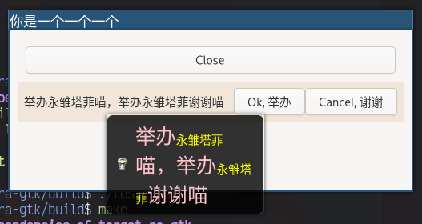

# 一些常见的组件

Gtkmm 自带了很多组件

1. [按钮类](#按钮类)
   1. [开关按钮 `Gtk::ToggleButton`](#开关按钮-gtktogglebutton-)
   1. [多选按钮 `Gtk::CheckButton`](#多选按钮-gtkcheckbutton-)
1. [范围类](#范围类)
   1. [比例组件 `Gtk::Scale`](#比例组件-gtkscale-)
   1. [滚动条 `Gtk::Scrollbar`](#滚动条-gtkscrollbar-)
1. [杂项](#杂项)
   1. [标签 `Gtk::Label`](#标签-gtklabel-)
   1. [条目 `Gtk::Entry`](#条目-gtkentry-)

## 按钮类

### 开关按钮（ `Gtk::ToggleButton` ）

跟普通的按钮差不多，但是可以通过 `bool get_active()` 获取按钮的状态（有没有被按下），按下后会有按下的效果：


### 多选按钮（ `Gtk::CheckButton` ）

跟开关按钮差不多，默认情况下只有外观不同，带有一个"☑️"，不能像普通按钮一样 `set_child()`


Gtkmm 4 好像删除了 `Gtk::RadioButton` ，但是 `Gtk::CheckButton` 可以通过 `set_group()` 变成类似单选按钮的组件


## 范围类

### 比例组件（ `Gtk::Scale` ）

像音量条一样的东西，拖动的时候会触发 `signal_value_changed()` 信号

构造函数里需要传一个 `Gtk::Adjustment` 指针，可以用 `Gtk::Adjustment::create(value, lower, upper, step_increment, page_increment, page_size)` 创建，还可以再传一个 `Gtk::Orientation` 进去设置这个条是横向的还是纵向的。


如果我没记错的话 Gtkmm 3 的时候这个东西是默认有数值显示的，现在可以手动打开，还可以设置数值的位置

```c++
scale_.set_value_pos(Gtk::Position::LEFT);
scale_.set_draw_value();
```


还可以把值的大小反过来，拉到头得到的值反而最小：

```c++
scale_.set_inverted();
```


### 滚动条（ `Gtk::Scrollbar` ）

标准的滚动条，只能用于滚动其他组件，但如果要滚动其他组件的话通常情况下用 `Gtk::ScrolledWindow` 更简单一些


## 杂项

### 标签（ `Gtk::Label` ）

普通的标签已经在[这里](./01.带图片的按钮.md)展示过了（嵌在按钮里了），还可以打开助记符（ mnemonic ），在想要加助记符的字符前面加上 `_` 就可以了，按下 `Alt` 的时候助记符会显示为下划线样式：

```c++
Gtk::Label label("_Label wi_th mnemoni_c", /* mnemonic */ true);
```


默认情况下标签不能折行，也就是说标签的最小宽度就是标签里的字符的宽度，用 `set_wrap()` 可以启用折行。启用折行后默认情况下文本是左对齐的，可以通过 `set_justify()` 来设置对齐方式：


还可以使用 [Pango 标记语法](https://docs.gtk.org/Pango/pango_markup.html)，需要 `set_use_markup()` 或 `set_markup()` ，比如：

```c++
Gtk::Label label(R"+*+*(<span font="Victor Mono 16" font_style="italic">RayAlto</span>)+*+*");
label.set_use_markup();
```


### 条目（ `Gtk::Entry` ）

用户可以在里面输入文字， `set_text()` 和 `get_text()` 可以对条目里的文字进行操作：


可以 `set_editable()` 设置条目是否可编辑，这里用默认的主题好像外观没有明显的变化， `set_visibility()` 可以决定条目是不是像密码框一样的外观（字符全用 `*` 挡住）：


还可以设置补全，但是过程非常麻烦，首先你需要自己定义一个 Model ，比如只有 `id` 和 `name` 两列这样：

```c++
#include "glibmm/ustring.h"
#include "gtkmm/treemodelcolumn.h"

class CompletionModelColumns : public Gtk::TreeModel::ColumnRecord {
public:
    CompletionModelColumns() {
        add(column_id);
        add(column_name);
    }

    Gtk::TreeModelColumn<unsigned int> column_id;
    Gtk::TreeModelColumn<Glib::ustring> column_name;
};
```

然后像这样把数据塞进去：

```c++
#include "glibmm/refptr.h"
#include "gtkmm/entrycompletion.h"
#include "gtkmm/liststore.h"
#include "gtkmm/treeiter.h"

// ...

Glib::RefPtr<Gtk::EntryCompletion> completion =
    Gtk::EntryCompletion::create();
// CompletionModelColumns completion_model_columns_;
Glib::RefPtr<Gtk::ListStore> completion_model =
    Gtk::ListStore::create(completion_model_columns_);
Gtk::TreeRow row = *(completion_model->append());
row[completion_model_columns_.column_id] = 1;
row[completion_model_columns_.column_name] = "你是一个一个一个";
row = *(completion_model->append());
row[completion_model_columns_.column_id] = 2;
row[completion_model_columns_.column_name] = "举办永雏塔菲喵";
row = *(completion_model->append());
row[completion_model_columns_.column_id] = 3;
row[completion_model_columns_.column_name] = "举办永雏塔菲谢谢喵";
row = *(completion_model->append());
row[completion_model_columns_.column_id] = 4;
row[completion_model_columns_.column_name] = "114514";
row = *(completion_model->append());
row[completion_model_columns_.column_id] = 5;
row[completion_model_columns_.column_name] = "1919810";
completion->set_model(completion_model);
completion->set_text_column(completion_model_columns_.column_name);
// Gtk::Entry entry_;
entry_.set_completion(completion);
```

然后就有补全了：

> 30 多行代码添加了 5 个补全， real nice


还可以 `set_icon_from_pixbuf()` 或 `set_icon_from_icon_name()` 给条目设置图标，图标默认在左边，可以传第二个参数 `Gtk::Entry::IconPosition::SECONDARY` 让图标在右边，条目的图标被按下/释放时会触发 `signal_icon_press()` 和 `signal_icon_release()`

```c++
entry_.set_icon_from_icon_name("edit-find");
```


还可以 `set_progress_fraction(double)` 设置一个进度提示，比如这里设置 10 个字符可以填满进度条：

```c++
entry_.signal_changed().connect([&]() -> void {
    entry_.set_progress_fraction(entry_.get_text_length() / 10.0);
});
```


### 微调按钮（ `Gtk::SpinButton` ）

外观来看就是条目组件右边加了一个加号和一个减号用来调整里面的值：


可以在构造函数里传一个 `Gtk::Adjustment` ，参数分别为：

- `value`：微调按钮的值
- `lower`：微调按钮允许的最小值
- `upper`：微调按钮允许的最大值
- `step_increment`：鼠标键 1（通常是左键）点击一下递增/递减的值
- `page_increment`：鼠标键 2（通常是右键，但我的 Logi M590 是中键）点击一下递增/递减的值
- `page_size`：目前没作用

也可以默认构造 `Gtk::SpinButton` 后通过 `get_adjustmemt()` 获取 `Gtk::Adjustment` 指针，然后调整里面的值（这时设置 `value` 不会生效了，想要设置的话可以使用 `Gtk::SpinButton::set_value` ）

还有，鼠标键 3（通常是中键，但我的 Logi M590 是右键）点加号/减号可以直接跳转到最大值/最小值

`double get_value()` 可以获取到值，而且是浮点，但不知道默认情况下里面可以输入非数字字符， `set_numeric()` 可以拒绝非数字字符，不懂 Gtk 为什么这么设计；默认情况下好像不会显示小数点后的数字，可以通过 `set_digits()` 设置显示小数点后几位

`set_wrap()` 可以让数值达到最大值/最小值的时候重新绕回最小值/最大值

`set_snap_to_ticks()` 可以限制数值在 `step_increment` 可以达到的范围，比如设置 `step_increment` 为 `5` ，那么输入 `9` 之后会被修正为 `10`

数值改变后会触发 `Gtk::SpinButton::signal_value_changed()` 或 `Gtk::Adjustment::signal_value_changed()`

### 进度条（ `Gtk::ProgressBar` ）

> 定时器的用法见[这里](./03.实用工具.md#定时器)

顾名思义是个进度条，但这个进度条不得了，它不光能表示进度，还能表示任务正在运行（进度无法确定），下面展示表示进度的进度条（用定时器模拟进度）：

- `set_fraction()` 用来设置进度（ `double` 类型，从 `0.0` 到 `1.0` ）
- `get_fraction()` 可以获取当前的进度值

```c++
Gtk::ProgressBar progress_bar;

// ...

sigc::connection timer = Glib::signal_timeout().connect(
    [&]() -> bool {
        double current_fraction = progress_bar.get_fraction();
        if (current_fraction < 1.0) {
            progress_bar.set_fraction(current_fraction + 0.01);
        }
        else {
            progress_bar.set_fraction(0.0);
        }
        return true;
    },
    20);
```


下面展示表示任务正在运行（进度无法确定）的进度条

- `set_pulse_step()` 可以设置每次小方块移动的距离
- `pulse()` 可以触发一次小方块的移动

```c++
Gtk::ProgressBar progress_bar;

// ...

sigc::connection timer = Glib::signal_timeout().connect(
    [&]() -> bool {
        progress_bar.pulse();
        return true;
    },
    20);
```


还可以使用 `set_show_text()` 显示 `set_text()` 的文字：


### 信息栏（ `Gtk::InfoBar` ）

在一个地方显示一些简短信息，是一个组件， API 与 `Gtk::Dialog` 十分相似

- `set_message_type(Gtk::MessageType)` 可以设置消息类型，但默认主题好像外观上没什么区别
- `add_child()` 可以添加任何子组件，例如标签
- `add_button(const Glib::ustring& button_text, int response_id)` 可以添加按钮，这里设置的 `id` 与回调的参数对应
- 单击通过 `add_button()` 添加的按钮会触发 `signal_response()` ，回调有一个参数为被单击的按钮的 `response_id`
- 默认情况下添加 `Gtk::InfoBar` 会直接显示，如果不需要可以 `hide()` 然后需要的时候 `show()` ，也可以在回调里满足条件的情况下调用 `hide()` “关掉”信息栏


### 提示框（ `Gtk::Tooltip` ）

据说任何组件都可以通过 `set_tooltip_text()` 或 `set_tooltip_markup()` 设置提示文本（仅限文本）


据说任何组件都可以通过 `signal_query_tooltip()` 实现更复杂的提示框，回调的最后一个参数是一个 `Gtk::Tooltip` 的指针，可以通过 `set_markup()` ， `set_icon()` ， `set_custom()` （这个甚至可以传一整个 `Widget` 进去）等方法定义更复杂的提示框

- 回调的前两个参数是相对父组件的坐标，第三个参数表示这个信号是不是键盘发出的，如果是的话坐标参数就没有意义了，不要使用

> 这种情况下需要 `set_has_tooltip()` 来告诉组件自己有提示框，组件才能正确发出 `signal_query_tooltip()` 信号


