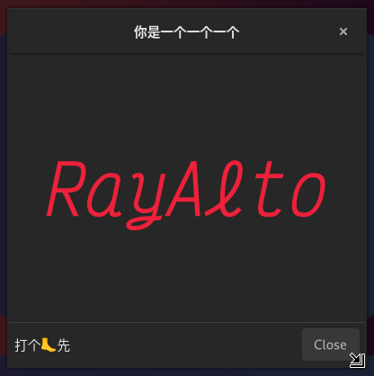
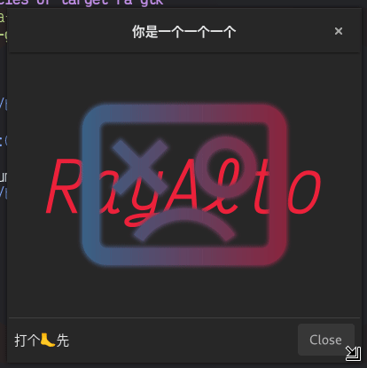
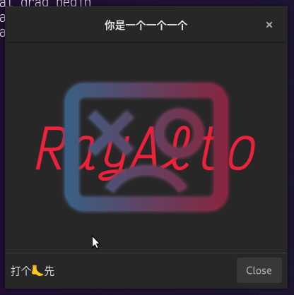
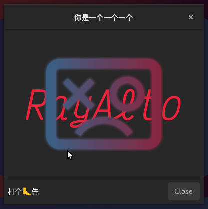

# 更多常见的组件

继[上篇](./02.一些常见的组件.md)

1. [对话框 `Gtk::Dialog`](#对话框-gtkdialog-)
   1. [消息对话框 `Gtk::MessageDialog`](#消息对话框-gtkmessagedialog-)
   1. [文件选择对话框 `Gtk::FileChooserDialog`](#文件选择对话框-gtkfilechooserdialog-)
   1. [颜色选择对话框 `Gtk::ColorChooserDialog`](#颜色选择对话框-gtkcolorchooserdialog-)
   1. [字体选择对话框 `Gtk::FontChooserDialog`](#字体选择对话框-gtkfontchooserdialog-)
   1. [关于对话框 `Gtk::AboutDialog`](#关于对话框-gtkaboutdialog-)
1. [绘画区域组件 `Gtk::DrawingArea`](#绘画区域组件-gtkdrawingarea-)
   1. [画直线](#画直线)
   1. [画曲线](#画曲线)
   1. [画圆](#画圆)
   1. [画文字](#画文字)
   1. [画图片](#画图片)
1. [拖放](#拖放)
   1. [拖](#拖-gtkdragsource-)
   1. [放](#放-gtkdroptarget-)
1. [剪切板](#剪切板-gdkclipboard-)
   1. [写剪切板](#写剪切板)
   1. [读剪切板](#读剪切板)

## 对话框（ `Gtk::Dialog` ）

直接继承自 `Gtk::Window` ，有很多种不同预设对话框，如果想要添加更多组件可以 `get_content_area()` 获得 `Gtk::Dialog` 的 `Gtk::Box` ；如果只需要在底部放一个 `Gtk::Button` 的话可以直接 `add_button()`

### 消息对话框（ `Gtk::MessageDialog` ）

就是展示消息的对话框：

```c++
Gtk::MessageDialog(
    /* parent window */ *this,
    /* title         */ "message",
    /* use_markup    */ false,
    /* message type  */ Gtk::MessageType::QUESTION,
    /* button type   */ Gtk::ButtonType::OK_CANCEL,
    /* modal         */ false
)
```

具体的信息还可以 `Gtk::MessageDialog::set_secondary_text()` 设置，还有 `Gtk::MessageDialog::set_hide_on_close()` 可以提供更像对话框的交互逻辑。当用户点了带有逻辑的按钮后会触发 `signal_response()` ，有一个 `int response_id` 参数，可以通过 `enum Gtk::ResponseType::XXX` 来 `switch`。


### 文件选择对话框（ `Gtk::FileChooserDialog` ）

都差不多：

```c++
Gtk::FileChooserDialog(
    /* parent window  */ *this,
    /* title          */ "Open",
    /* action         */ Gtk::FileChooserDialog::Action::OPEN,
    /* use header bar */ false
)
```

> 这里第四个参数最好填 `false` 如果填 `true` 会导致按钮不显示

可以加一些 `filter` 来限制选择文件的类型：

```c++
Glib::RefPtr<Gtk::FileFilter> filter = Gtk::FileFilter::create()
filter->set_name("C Source File")
filter->add_suffix("c");
filter->add_mime_type("text/x-c"); // 这个好像不怎么准
file_chooser_dialog->add_filter(filter);
```


### 颜色选择对话框（ `Gtk::ColorChooserDialog` ）

选颜色的，默认有两个按钮 `Select` 和 `Cancel` ，一般不用再加按钮了。通过 `Gtk::ColorChooserDialog::get_rgba()` 可以获取用户选择的颜色（如果用户没有选择的话这个方法可能没有意义，最好放在 `signal_response()` 的回调里：


### 字体选择对话框（ `Gtk::FontChooserDialog` ）

选字体的，也默认有两个按钮 `Select` 和 `Cancel` ，通过 `Gtk::FontChooserDialog::get_font()` 可以获取用户选择的字体的 pango font description 字符串


### 关于对话框（ `Gtk::AboutDialog` ）

好多 GNOME 应用都有这个东西，可以设置很多东西：

```c++
about_dialog_.set_transient_for(*this);
about_dialog_.set_modal();
about_dialog_.set_hide_on_close();
about_dialog_.set_logo(Gdk::Texture::create_from_filename(
    "my-awesome-logo.png"));
about_dialog_.set_program_name("1919 Application");
about_dialog_.set_version("114.514");
about_dialog_.set_copyright("Ray Alto");
about_dialog_.set_comments("你是一个一个一个");
about_dialog_.set_license("WTFL");
about_dialog_.set_website("https://www.rayalto.top");
about_dialog_.set_website_label("Ray Alto's Blog");
about_dialog_.set_authors({"Ray Alto", "Anonymous", "Ace Taffy"});
/* about_dialog_.set_titlebar(*Gtk::make_managed<Gtk::HeaderBar>()); */
```

> 注意这里把 `set_titlebar` 注释掉了，因为 `Gtk::AboutDialog` 有一个自己的 title bar ，再设置一个 title bar 会覆盖掉原生的 title bar


## 绘画区域组件（ `Gtk::DrawingArea` ）

> 记得 `set_expand()`

可以通过 `Gtk::DrawingArea::set_draw_func()` 来设置绘制回调，其中三个参数分别为：

1. `const Cairo::RefPtr<Cairo::Context>& context`: Cairo 的上下文，用来实际绘制图像
1. `int width`: 画布的宽度
1. `int height`: 画布的长度

> 1. `Cairo::Context::scale()` 传入画布的大小后，用户就可以使用相对值（ 0.0 - 1.0 之间）表示画布上的点了
> 1. `Cairo::Context::translate()` 传入一个坐标，这个坐标就会变成原点，后面使用的所有坐标都是相对与这个坐标的
>
> 注意如果用了这些的话如果组件尺寸过小的时候可能会导致程序崩溃

### 画直线

- `Cairo::Context::move_to`: 把画笔抬起来，移动到一个坐标
- `Cairo::Context::line_to`: 把笔按到画布上，直线移动到一个坐标，创建一个直线路径
- `Cairo::Context::stroke`: 给路径描边
- `Cairo::Context::fill`: 填充路径
- `Cairo::Context::paint`: 把当前的 `source` 填满整个区域

> `Cairo::Context::clip()` ， `Cairo::Context::fill()` ， `Cairo::Context::stroke()` 一般都会清除当前路径，准备创建一个新的路径，但它们都有对应的 `_preserve()` 可以保留当前的路径，比如调用了 `stroke_preserve()` 之后还可以 `fill()` ，如果调用了 `stroke()` 之后 `fill()` 是无效的，因为 `stroke()` 清空了路径 `fill()` 不会填充任何路径

比如画一个八边形（ `Cairo::Context::move_to` 和 `Cairo::Context::line_to` ）：


`Cairo::Context::set_line_join()` 可以设置线条的连接类型：

| `Cairo::Context::LineJoin::MITER`                                                 | `Cairo::Context::LineJoin::ROUND`                                             | `Cairo::Context::LineJoin::BEVEL`                                                 |
| --------------------------------------------------------------------------------- | ----------------------------------------------------------------------------- | --------------------------------------------------------------------------------- |
|  |  |  |

> 如果图形是封闭的画最后的线条可能并不连贯，可以 `Cairo::Context::close_path()` 来闭合终点和起点

### 画曲线

> 就是三次贝塞尔曲线

- `Cairo::Context::curve_to`: 目前画笔所在坐标作为起点，传入三组坐标（控制点一、控制点二、终点），画出一条三次贝塞尔曲线


### 画圆

- `Cairo::Context::arc`: 画圆，参数如下：
  1. `double x`: 原点 X 轴坐标
  1. `double y`: 原点 Y 轴坐标
  1. `double radius`: 半径
  1. `double angle1`: 起点（ 0 - 2PI ）
  1. `double angle2`: 终点（ 0 - 2PI ）


### 画文字

最简单的方式就是 `Gtk::Widget::create_pango_layout("text")` 创建一个 `Pango::Layout` ，然后用 `Pango::Layout::show_in_cairo_context()` 画在 `Cairo::Context` 里

```c++
Pango::FontDescription font;
font.set_family("VictorMono Nerd Font");
font.set_style(Pango::Style::ITALIC);
font.set_size(width / 6 * Pango::SCALE);
cr->set_source_rgb(utils::color2float(0xed),
                   utils::color2float(0x21),
                   utils::color2float(0x3a));
Glib::RefPtr<Pango::Layout> layout = create_pango_layout("RayAlto");
layout->set_font_description(font);
int text_width, text_height;
layout->get_pixel_size(text_width, text_height);
cr->move_to((width - text_width) / 2.0, (height - text_height) / 2.0);
layout->show_in_cairo_context(cr);
```



### 画图片

`Gdk::Pixbuf::create_from_xxx()` 可以创建 `Glib::RefPtr<Gdk::Pixbuf>` ，而且可以设置目标大小、是否保持图片原比例。然后可以 `Gdk::Cairo::set_source_pixbuf()` 把创建好的 `Gdk::Pixbuf` 塞进 `Cairo::Context` 里，然后 `Cairo::Context::rectangle()` ， `Cairo::Context::fill()` 把图片画出来：

```c++
Glib::RefPtr<Gdk::Pixbuf> image = Gdk::Pixbuf::create_from_file(
    "my-awesome-image.svg", width * 0.8, height * 0.8);
Gdk::Cairo::set_source_pixbuf(cr,
                              image,
                              (width - image->get_width()) / 2.0,
                              (height - image->get_height()) / 2.0);
cr->rectangle((width - image->get_width()) / 2.0,
              (height - image->get_height()) / 2.0,
              image->get_width(),
              image->get_height());
cr->fill();
```

> `Gdk::Cairo::set_source_pixbuf` 来自头文件 `gdkmm/general.h`



## 拖放

拖放也是一种 `Gtk::EventController` 需要组件通过 `Gtk::Widget::add_controller()` 加进去

### 拖（ `Gtk::DragSource` ）

通过 `Gtk::DragSource::create()` 创建一个 `Glib::RefPtr<Gtk::DragSource>` ，通过给它的各种 `signal` 添加回调可以实现拖：

```c++
Glib::RefPtr<Gtk::DragSource> source = Gtk::DragSource::create();
source->set_actions(Gdk::DragAction::COPY);
source->signal_prepare().connect(
    [&](double x, double y) -> Glib::RefPtr<Gdk::ContentProvider> {
        std::cout << "drag signal_prepare" << std::endl;
        Glib::Value<Glib::ustring> ustring_value;
        ustring_value.init(ustring_value.value_type());
        ustring_value.set("你是一个一个一个");
        return Gdk::ContentProvider::create(ustring_value);
    },
    false);
// source->signal_drag_begin().connect(
//     [&](const Glib::RefPtr<Gdk::Drag>& drag) -> void {
//         // ...
//     });
// source->signal_drag_cancel().connect(
//     [&](const Glib::RefPtr<Gdk::Drag> drag,
//         Gdk::DragCancelReason reason) -> bool {
//         // ...
//     },
//     false);
// source->signal_drag_end().connect(
//     [&](const Glib::RefPtr<Gdk::Drag>& drag, bool delete_data) -> void {
//         // ...
//     },
//     false);
```

然后选好一个组件，比如我选择一个 `Gtk::Label label` ，把这个 `Gtk::DragSource` 塞进去：

```c++
label.add_controller(source);
```

### 放（ `Gtk::DropTarget` ）

通过 `Gtk::DropTarget::create()` 创建一个 `Glib::RefPtr<Gtk::DropTarget>` ，通过给它的各种 `signal` 添加回调可以实现放：

```c++
Glib::RefPtr<Gtk::DropTarget> target = Gtk::DropTarget::create(
    Glib::Value<Glib::ustring>::value_type(), Gdk::DragAction::COPY);
target->signal_drop().connect(
    [&](const Glib::ValueBase& value, double x, double y) -> bool {
        std::cout << "drop signal_drop" << std::endl;
        if (G_VALUE_HOLDS(value.gobj(),
                          Glib::Value<Glib::ustring>::value_type())) {
            Glib::Value<Glib::ustring> ustring_value;
            ustring_value.init(value.gobj());
            const Glib::ustring& dropped_string = ustring_value.get();
            std::cout << "Received: " << dropped_string << std::endl;
            return true;
        }
        else {
            std::cout << "Received unexpected data type ["
                      << G_VALUE_TYPE_NAME(value.gobj()) << "]"
                      << std::endl;
            return false;
        }
    },
    false);
// target->signal_accept().connect(
//     [&](const Glib::RefPtr<Gdk::Drop>& drop) -> bool {
//         // ...
//     },
//     false);
// target->signal_enter().connect(
//     [&](double x, double y) -> Gdk::DragAction {
//         // ...
//     },
//     false);
// target->signal_leave().connect(
//     [&]() -> void {
//         // ...
//     },
//     false);
// target->signal_motion().connect(
//     [&](double x, double y) -> Gdk::DragAction {
//         // ...
//     },
//     false);
```

然后选好一个组件，比如我选择一个 `Gtk::Button button` ，把这个 `Gtk::DragSource` 塞进去：

```c++
button.add_controller(target);
```

效果就像这样：



### 更复杂的拖放

- `Gtk::DropControllerMotion`: 用于监测拖放操作过程中的动作，比如拖放过程中鼠标进入、离开组件
- `Gtk::DropTargetAsync`: 功能最丰富的监测放操作的 controller ，很多 API 与 `Gtk::DropTarget` 不同

## 剪切板（ `Gdk::Clipboard` ）

通过 `Gtk::Widget::get_clipboard` 或 `Gdk::Display::get_clipboard` 获取到 `Glib::RefPtr<Gdk::Clipboard>`

### 写剪切板

有一系列 `Gdk::Clipboard::set_xx` 方法，最简单的可以 `Gdk::Clipboard::set_text("114514")` ，下面展示一种复杂的方法：

```c++
Glib::Value<Glib::ustring> value;
value.init(value.value_type());
value.set("114514");
Glib::RefPtr<Gdk::ContentProvider> content = Gdk::ContentProvider::create(value);
get_clipboard()->set_content(content);
```

### 读剪切板

也有一系列 `Gdk::Clipboard::read_xx` 方法，下面展示最简单的方法（假设内容是文本）：

```c++
get_clipboard()->read_text_async(
    [&](Glib::RefPtr<Gio::AsyncResult>& result) -> void {
        Glib::ustring text;
        try {
            text = get_clipboard()->read_text_finish(result);
        }
        catch (const Glib::Error& err) {
            std::cout << "Read clipboard error: " << err.what()
                      << std::endl;
        }
        std::cout << "Read from clipboard: " << text << std::endl;
    });
```

## 打印

> 暂时用不到

## 最近使用过的文件

> 暂时用不到

## 键盘事件

`Gtk::EventControllerKey::create()` 可以获取 `Glib::RefPtr<Gtk::EventControllerKey>` ，对这个东西会发出 `signal_key_press()` 和 `signal_key_release()` ，用于对键盘事件进行响应：

```c++
Glib::RefPtr<Gtk::EventControllerKey> key_controller =
    Gtk::EventControllerKey::create();
key_controller->signal_im_update().connect(
    [&]() -> void { std::cout << "IM Updated" << std::endl; });
key_controller->signal_key_pressed().connect(
    [&](guint key_value, guint key_code, Gdk::ModifierType state) -> bool {
        if ((key_value == GDK_KEY_1)
            && (state
                & (Gdk::ModifierType::SHIFT_MASK
                   | Gdk::ModifierType::CONTROL_MASK
                   | Gdk::ModifierType::ALT_MASK))
                   == Gdk::ModifierType::ALT_MASK) {
            // Alt + 1
            left_label.set_text("💦");
            return true;
        }
        return false;
    },
    false);
key_controller->signal_key_released().connect(
    [&](guint key_value, guint key_code, Gdk::ModifierType state) -> void {
        if ((key_value == GDK_KEY_1)
            && (state
                & (Gdk::ModifierType::SHIFT_MASK
                   | Gdk::ModifierType::CONTROL_MASK
                   | Gdk::ModifierType::ALT_MASK))
                   == Gdk::ModifierType::ALT_MASK) {
            // Alt + 1
            left_label.set_text("打个🦶先");
        }
    },
    false);
```

然后把这个 controller 塞到 `Gtk::Window` 里：

> 塞进 `Gtk::Window` 里的组件可能不会响应，因为事件会先到达 `Gtk::Window` ，只有 `Gtk::Window` 对应的键盘事件回调返回 `false` 这个事件才会继续往下传

```c++
add_controller(key_controller);
```


