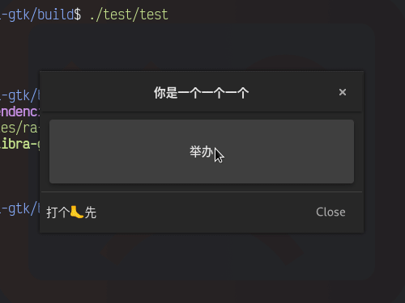

# 更多常见的组件

继[上篇](./02.一些常见的组件.md)

1. [对话框](#对话框-gtkdialog-)
   1. [消息对话框](#消息对话框-gtkmessagedialog-)
   1. [文件选择对话框](#文件选择对话框-gtkfilechooserdialog-)
   1. [颜色选择对话框](#颜色选择对话框-gtkcolorchooserdialog-)
   1. [字体选择对话框](#字体选择对话框-gtkfontchooserdialog-)
   1. [关于对话框](#关于对话框-gtkaboutdialog-)

## 对话框（ `Gtk::Dialog` ）

直接继承自 `Gtk::Window` ，有很多种不同预设对话框，如果想要添加更多组件可以 `get_content_area()` 获得 `Gtk::Dialog` 的 `Gtk::Box` ；如果只需要在底部放一个 `Gtk::Button` 的话可以直接 `add_button()`

### 消息对话框（ `Gtk::MessageDialog` ）

就是展示消息的对话框：

```c++
Gtk::MessageDialog(
    /* parent window */ *this,
    /* title         */ "message",
    /* use_markup    */ false,
    /* message type  */ Gtk::MessageType::QUESTION,
    /* button type   */ Gtk::ButtonType::OK_CANCEL,
    /* modal         */ false
)
```

具体的信息还可以 `Gtk::MessageDialog::set_secondary_text()` 设置，还有 `Gtk::MessageDialog::set_hide_on_close()` 可以提供更像对话框的交互逻辑。当用户点了带有逻辑的按钮后会触发 `signal_response()` ，有一个 `int response_id` 参数，可以通过 `enum Gtk::ResponseType::XXX` 来 `switch`。


### 文件选择对话框（ `Gtk::FileChooserDialog` ）

都差不多：

```c++
Gtk::FileChooserDialog(
    /* parent window  */ *this,
    /* title          */ "Open",
    /* action         */ Gtk::FileChooserDialog::Action::OPEN,
    /* use header bar */ false
)
```

> 这里第四个参数最好填 `false` 如果填 `true` 会导致按钮不显示

可以加一些 `filter` 来限制选择文件的类型：

```c++
Glib::RefPtr<Gtk::FileFilter> filter = Gtk::FileFilter::create()
filter->set_name("C Source File")
filter->add_suffix("c");
filter->add_mime_type("text/x-c"); // 这个好像不怎么准
file_chooser_dialog->add_filter(filter);
```


### 颜色选择对话框（ `Gtk::ColorChooserDialog` ）

选颜色的，默认有两个按钮 `Select` 和 `Cancel` ，一般不用再加按钮了。通过 `Gtk::ColorChooserDialog::get_rgba()` 可以获取用户选择的颜色（如果用户没有选择的话这个方法可能没有意义，最好放在 `signal_response()` 的回调里：



### 字体选择对话框（ `Gtk::FontChooserDialog` ）

选字体的，也默认有两个按钮 `Select` 和 `Cancel` ，通过 `Gtk::FontChooserDialog::get_font()` 可以获取用户选择的字体的 pango font description 字符串


### 关于对话框（ `Gtk::AboutDialog` ）

好多 GNOME 应用都有这个东西，可以设置很多东西：

```c++
about_dialog_.set_transient_for(*this);
about_dialog_.set_modal();
about_dialog_.set_hide_on_close();
about_dialog_.set_logo(Gdk::Texture::create_from_filename(
    "my-awesome-logo.png"));
about_dialog_.set_program_name("1919 Application");
about_dialog_.set_version("114.514");
about_dialog_.set_copyright("Ray Alto");
about_dialog_.set_comments("你是一个一个一个");
about_dialog_.set_license("WTFL");
about_dialog_.set_website("https://www.rayalto.top");
about_dialog_.set_website_label("Ray Alto's Blog");
about_dialog_.set_authors({"Ray Alto", "Anonymous", "Ace Taffy"});
/* about_dialog_.set_titlebar(*Gtk::make_managed<Gtk::HeaderBar>()); */
```

> 注意这里把 `set_titlebar` 注释掉了，因为 `Gtk::AboutDialog` 有一个自己的 title bar ，再设置一个 title bar 会覆盖掉原生的 title bar


## 绘画区域组件（ `Gtk::DrawingArea` ）

> 记得 `set_expand()`

可以通过 `Gtk::DrawingArea::set_draw_func()` 来设置绘制回调，其中三个参数分别为：

1. `const Cairo::RefPtr<Cairo::Context>& context`: Cairo 的上下文，用来实际绘制图像
1. `int width`: 画布的宽度
1. `int height`: 画布的长度

> 1. `Cairo::Context::scale()` 传入画布的大小后，用户就可以使用相对值（ 0.0 - 1.0 之间）表示画布上的点了
> 1. `Cairo::Context::translate()` 传入一个坐标，这个坐标就会变成原点，后面使用的所有坐标都是相对与这个坐标的

### 画直线

- `Cairo::Context::move_to`: 把画笔抬起来，移动到一个坐标
- `Cairo::Context::line_to`: 把笔按到画布上，直线移动到一个坐标，创建一个直线路径
- `Cairo::Context::stroke`: 给路径描边
- `Cairo::Context::fill`: 填充路径

> `Cairo::Context::clip()` ， `Cairo::Context::fill()` ， `Cairo::Context::stroke()` 一般都会清除当前路径，准备创建一个新的路径，但它们都有对应的 `_preserve()` 可以保留当前的路径，比如调用了 `stroke_preserve()` 之后还可以 `fill()` ，如果调用了 `stroke()` 之后 `fill()` 是无效的，因为 `stroke()` 清空了路径 `fill()` 不会填充任何路径

比如画一个八边形（ `Cairo::Context::move_to` 和 `Cairo::Context::line_to` ）：


`Cairo::Context::set_line_join()` 可以设置线条的连接类型：

| `Cairo::Context::LineJoin::MITER`                                                 | `Cairo::Context::LineJoin::ROUND`                                             | `Cairo::Context::LineJoin::BEVEL`                                                 |
| --------------------------------------------------------------------------------- | ----------------------------------------------------------------------------- | --------------------------------------------------------------------------------- |
|  |  |  |

> 如果图形是封闭的画最后的线条可能并不连贯，可以 `Cairo::Context::close_path()` 来闭合终点和起点

### 画曲线

> 就是三次贝塞尔曲线

- `Cairo::Context::curve_to`: 目前画笔所在坐标作为起点，传入三组坐标（控制点一、控制点二、终点），画出一条三次贝塞尔曲线


### 画圆

- `Cairo::Context::arc`: 画圆，参数如下：
  1. `double x`: 原点 X 轴坐标
  1. `double y`: 原点 Y 轴坐标
  1. `double radius`: 半径
  1. `double angle1`: 起点（ 0 - 2PI ）
  1. `double angle2`: 终点（ 0 - 2PI ）


