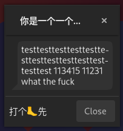
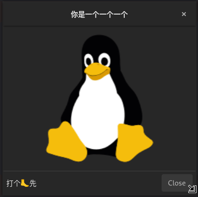
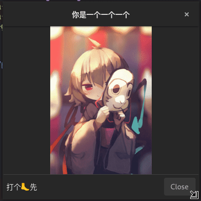

# 自定义组件

1. [简单的自定义组件](#简单的自定义组件)
1. [通过缝合自定义组件](#通过缝合自定义组件)

## 简单的自定义组件

一个简单的自定义组件：

```c++
#include "glibmm/refptr.h"
#include "gtkmm/enums.h"
#include "gtkmm/widget.h"

class RaWidget : public Gtk::Widget {
public:
    RaWidget();
    RaWidget(const RaWidget&) = delete;
    RaWidget(RaWidget&&) noexcept = default;
    RaWidget& operator=(const RaWidget&) = delete;
    RaWidget& operator=(RaWidget&&) noexcept = default;

    virtual ~RaWidget() = default;

protected:
    Gtk::SizeRequestMode get_request_mode_vfunc() const override;
    void measure_vfunc(Gtk::Orientation orientation,
                       int for_size,
                       int& minimum,
                       int& natural,
                       int& minimum_baseline,
                       int& natural_baseline) const override;
    void on_map() override;
    void on_unmap() override;
    void on_realize() override;
    void on_unrealize() override;
    void snapshot_vfunc(const Glib::RefPtr<Gtk::Snapshot>& snapshot) override;
};
```

定义：

```c++
#include "ra-widget.h"

#include <iostream>

#include "glibmm/objectbase.h"
#include "gtkmm/enums.h"
#include "gtkmm/widget.h"

RaWidget::RaWidget() :
    // GType 名会是 gtkmm__CustomObject_RaWidget
    Glib::ObjectBase("RaWidget"),
    // base con
    Gtk::Widget() {}

// 下面都只是调用了 Gtk::Widget 的方法，没有修改

Gtk::SizeRequestMode RaWidget::get_request_mode_vfunc() const {
    return Gtk::Widget::get_request_mode_vfunc();
}

void RaWidget::measure_vfunc(Gtk::Orientation orientation,
                             int for_size,
                             int& minimum,
                             int& natural,
                             int& minimum_baseline,
                             int& natural_baseline) const {
    if (orientation == Gtk::Orientation::HORIZONTAL) {
        // width
        minimum = 60;
        natural = 100;
    }
    else if (orientation == Gtk::Orientation::VERTICAL) {
        // height
        minimum = 50;
        natural = 70;
    }
    // disable baseline alignment
    minimum_baseline = -1;
    natural_baseline = -1;
}

void RaWidget::on_map() {
    Gtk::Widget::on_map();
}

void RaWidget::on_unmap() {
    Gtk::Widget::on_unmap();
}

void RaWidget::on_realize() {
    Gtk::Widget::on_realize();
}

void RaWidget::on_unrealize() {
    Gtk::Widget::on_unrealize();
}

void RaWidget::snapshot_vfunc(const Glib::RefPtr<Gtk::Snapshot>& snapshot) {
    Gtk::Widget::snapshot_vfunc(snapshot);
}
```

## 通过缝合自定义组件

今天想做一个消息泡泡，试着扩展 `Gtk::Label` ，但是就一个简单的边框都加不上，因为我不知道怎么只给 `Gtk::Label` 的文本加 margin ，所以就扩展 `Gtk::Widget` 然后把 `Gtk::Label` 缝进去，这个时候这个缝合出来的自定义组件算是一个自定义容器，所以至少要这样：

```c++
class MessageBubble : public Gtk::Widget {
public:
    MessageBubble();
    MessageBubble(const MessageBubble&) = delete;
    MessageBubble(MessageBubble&&) noexcept = default;
    MessageBubble& operator=(const MessageBubble&) = delete;
    MessageBubble& operator=(MessageBubble&&) noexcept = default;

    virtual ~MessageBubble();

    // 返回组件的 Gtk::SizeRequestMode
    Gtk::SizeRequestMode get_request_mode_vfunc() const override;
    // 计算组件大小
    void measure_vfunc(Gtk::Orientation orientation,
                       int for_size,
                       int& minimum,
                       int& natural,
                       int& minimum_baseline,
                       int& natural_baseline) const override;
    // 给子组件分配位置和大小
    void size_allocate_vfunc(int width, int height, int baseline) override;
    // 绘制
    void snapshot_vfunc(const Glib::RefPtr<Gtk::Snapshot>& snapshot) override;

    // 要缝进去的 Gtk::Label
    Gtk::Label label;
};

MessageBubble::MessageBubble() :
    Glib::ObjectBase("MessageBubble"), Gtk::Widget(), label() {
    // Gtk::Label 要能折行
    label.set_wrap();
    // Gtk::Label 折行太复杂了，有时候反而不好用
    label.set_wrap_mode(Pango::WrapMode::WORD_CHAR);
    // 建立连接
    label.set_parent(*this);
}

MessageBubble::~MessageBubble() {
    // 断开连接
    label.unparent();
}

Gtk::SizeRequestMode MessageBubble::get_request_mode_vfunc() const {
    // 就用 Gtk::Label 的 Gtk::SizeRequestMode
    return label.get_request_mode();
}

void MessageBubble::measure_vfunc(Gtk::Orientation orientation,
                                  int for_size,
                                  int& minimum,
                                  int& natural,
                                  int& minimum_baseline,
                                  int& natural_baseline) const {
    // 官方一直说禁用 baseline ，我也不知道有什么用
    minimum_baseline = -1;
    natural_baseline = -1;
    // 给 Gtk::Label 乱糊一个 baseline 变量，也是为了禁用 baseline
    int dummy_minimum_baseline = 0;
    int dummy_natural_baseline = 0;
    // 水平方向（宽度）
    if (orientation == Gtk::Orientation::HORIZONTAL) {
        // 保存 Gtk::Label 算出来的一组 width
        int child_minimum_width = 0;
        int child_natural_width = 0;
        label.measure(orientation,
                      for_size,
                      child_minimum_width,
                      child_natural_width,
                      dummy_minimum_baseline,
                      dummy_natural_baseline);
        // 在 Gtk::Label 算出来的宽度基础上再加 20 ，方便绘制边框
        minimum = child_minimum_width + 20;
        natural = child_natural_width + 20;
    }
    // 垂直方向（高度）
    else if (orientation == Gtk::Orientation::VERTICAL) {
        // 保存 Gtk::Label 算出来的一组 height
        int child_minimum_height = 0;
        int child_natural_height = 0;
        label.measure(orientation,
                      for_size,
                      child_minimum_height,
                      child_natural_height,
                      dummy_minimum_baseline,
                      dummy_natural_baseline);
        // 在 Gtk::Label 算出来的宽度基础上再加 10 ，方便绘制边框
        minimum = child_minimum_height + 10;
        natural = child_natural_height + 10;
    }
}

void MessageBubble::size_allocate_vfunc(int width, int height, int baseline) {
    // 给 Gtk::Label 分配位置和大小
    Gtk::Allocation child_allocation;
    // 位置： (15, 5)
    child_allocation.set_x(15);
    child_allocation.set_y(5);
    // 大小： 留出一定空间用于绘制边框
    child_allocation.set_width(width - 20);
    child_allocation.set_height(height - 10);
    // 传给 Gtk::Label
    label.size_allocate(child_allocation, baseline);
}

void MessageBubble::snapshot_vfunc(
    const Glib::RefPtr<Gtk::Snapshot>& snapshot) {
    // 绘制边框
    const Gtk::Allocation& allocation = get_allocation();
    const int& canvas_width = allocation.get_width();
    const int& canvas_height = allocation.get_height();
    const Gdk::Rectangle rect(0, 0, canvas_width, canvas_height);
    Cairo::RefPtr<Cairo::Context> context = snapshot->append_cairo(rect);
    context->set_line_width(1);
    context->set_source_rgb(utils::color2float(0xff),
                            utils::color2float(0xff),
                            utils::color2float(0xff));
    context->move_to(10, 10);
    context->curve_to(11, 1, 11, 1, 20, 0);
    context->line_to(canvas_width - 10, 0);
    context->curve_to(
        canvas_width - 1, 1, canvas_width - 1, 1, canvas_width, 10);
    context->line_to(canvas_width, canvas_height - 10);
    context->curve_to(canvas_width - 1,
                      canvas_height - 1,
                      canvas_width - 1,
                      canvas_height - 1,
                      canvas_width - 10,
                      canvas_height);
    context->line_to(0, canvas_height);
    context->line_to(10, canvas_height - 10);
    context->line_to(10, 10);
    context->close_path();
    context->fill();
    // 绘制子组件
    Gtk::Widget::snapshot_vfunc(snapshot);
}
```



## 画图片/动画

Gtk 也自带了一些可以展示图片的组件，比如 `Gtk::Image` （残废） ， `Gtk::Picture` （半个残废） 。都不怎么好用，所以自己画比较好：

```c++
class Image : public Gtk::Widget {
public:
    Image();
    Image(const Image&) = delete;
    Image(Image&&) noexcept = default;
    Image& operator=(const Image&) = delete;
    Image& operator=(Image&&) noexcept = default;

    virtual ~Image() = default;

    void snapshot_vfunc(const Glib::RefPtr<Gtk::Snapshot>& snapshot) override;
};
```

核心就是重写 `snapshot_vfunc` ，这个负责组件的绘制，比如绘制静态图片：

```c++
void Image::snapshot_vfunc(const Glib::RefPtr<Gtk::Snapshot>& snapshot) {
    // 获取组件大小
    const Gtk::Allocation& allocation = get_allocation();
    // 创建一个 Cairo::Context
    const Gdk::Rectangle canvas(0, 0, canvas_width, canvas_height);
    Cairo::RefPtr<Cairo::Context> context = snapshot->append_cairo(canvas);
    // 读图片
    Glib::RefPtr<Gdk::Pixbuf> pixbuf = Gdk::Pixbuf::create_from_file("test.svg");
    // 把图片数据放进 Cairo::Context
    Gdk::Cairo::set_source_pixbuf(context, pixbuf);
    // 设置图片的填充区域
    context->rectangle(0, 0, allocation.get_width(), allocation.get_height());
    // 填充图片
    context->fill();
}
```



绘制动态图片可以通过 `Glib::signal_timeout.connect_once` （负责定时绘制下一帧）和 `Gdk::PixbufAnimation` （负责读取各种类型的资源）系列实现：

```c++
void Image::snapshot_vfunc(const Glib::RefPtr<Gtk::Snapshot>& snapshot) {
    // 获取组件大小
    const Gtk::Allocation& allocation = get_allocation();
    // 创建一个 Cairo::Context
    const Gdk::Rectangle canvas(0, 0, canvas_width, canvas_height);
    Cairo::RefPtr<Cairo::Context> context = snapshot->append_cairo(canvas);
    // 读图片
    Glib::RefPtr<Gdk::PixbufAnimation> pixbuf_animation = Gdk::PixbufAnimation::create_from_file("test.gif");
    // 用来遍历图片的每一帧
    Glib::RefPtr<Gdk::PixbufAnimationIter> pixbuf_animation_iter = pixbuf_animation->get_iter();
    // 把图片数据放进 Cairo::Context
    Gdk::Cairo::set_source_pixbuf(context, pixbuf_animation_iter->get_pixbuf());
    // 设置图片的填充区域
    context->rectangle(0, 0, allocation.get_width(), allocation.get_height());
    // 填充图片
    context->fill();
    // 跳到下一帧
    pixbuf_animation_iter_->advance();
    // 设置合适的时间通过 queue_draw 重新绘制组件，以此绘制下一帧
    Glib::signal_timeout().connect_once(
        sigc::mem_fun(*this, &Image::queue_draw),
        pixbuf_animation_iter_->get_delay_time());
}
```


