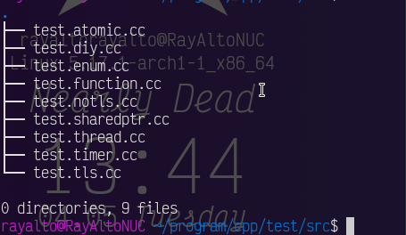

# 实用工具

Gtkmm 这一组套件里有很多实用工具，但是貌似大多数都运行在 `Gtk::Application` 里，下面为了方便就不去创建 `Gtk::Window` 而是用 `Gtk::Application::hold()` 和 `Gtk::Application::release()` 骗 `Gtk::Application` 运行下去

## 定时器

像其他 Gtkmm 组件的 signal 一样 `connect()` 一个回调，再加上 interval （毫秒为单位），就可以启动了。回调没有参数，返回值类型为 `bool` ，返回 `true` 定时器继续运行，返回 `false` 定时器就会停止，当然也可以 `sigc::connection::disconnect()` 直接停止计时器，比如下面的代码输出 10 次之后会定时器就会停止。

```c++
#include "glibmm/main.h" // Glib::signal_timeout()
#include "sigc++/connection.h" // sigc::connection

// ...

int count = 0;

sigc::connection timer = Glib::signal_timeout().connect(
    /* callback */ [&]() -> bool {
        if (count < 10) {
            std::cout << "举办永雏塔菲喵，举办永雏塔菲谢谢喵" << std::endl;
            count += 1;
            return true;
        }
        return false;
    },
    /* interval */ 100);

/* 这样可以“强行”停止计时器 */
// timer.disconnect()
```



## 让父容器自动管理组件内存

```c++
Gtk::Button* button = Gtk::make_managed<Gtk::Button>();
```

这样 Gtk 会帮你 `new` 一个 `Gtk::Button` ，然后 `set_manage()` ，把内存的管理交给父容器，不需要手动 `delete button`

## 根据文件内容推断文件类型

Giomm 提供了一系列文件类型相关的函数，里面就有根据文件内容推断文件类型的函数，比如有一个文件没有后缀，但我想知道这个文件的 mime type ，可以这样：

```c++
std::ifstream file_stream("foo.bar", std::ios::binary);
std::string data((std::istreambuf_iterator<char>(file_stream)),
                 (std::istreambuf_iterator<char>()));
bool certain {false};
std::cout << Gio::content_type_guess(std::string {}, data, certain) << std::endl;
```

这样会让 Giomm 通过文件内容推断文件类型，输出 mime type ，比如 `image/png`
