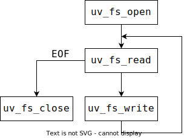

# 文件系统

> 我讨厌傻逼函数指针。

## 改善回调的定义方式

连状态都没有的函数指针作为回调在 Modern C++ 里坚决不能接受！我要用 `std::function` 。好像 libuv 的回调都是一个指针作为参数，没有返回值，所以可以简单包装一下，然后放进 `data` 里面调用，比如一个简陋的包装（但比傻逼函数指针好用多了）：

```c++
using LibuvCallback = std::function<void(void*)>;
```

然后把所有的回调都设置成这个函数（作为函数指针）：

```c++
void libuv_fs_callback(uv_fs_t* req) {
    LibuvCallback& callback = *reinterpret_cast<LibuvCallback*>(req->data);
    callback(req);
}
```

最后把 `LibuvCallback` 放进 handler 里：

```c++
// 比如你的 callback 定义在这里
LibuvCallback callback([&](void* data) -> void{
    uv_fs_t* req = reinterpret_cast<uv_fs_t*>(data);
    // 做任何事
});
// 你的 handler
uv_fs_t open_req;
// 只需要这样
open_req.data = &callback;
```

舒服了，我可以随便定义回调，可以是个 `labmda` 、可以是个 `std::function` ，我可以捕获变量、我还可以 `std::bind` ，超越函数指针十个世纪。后面所有的代码都默认有下面的定义：

```c++
#include <functional>

using LibuvCallback = std::function<void(void*)>;

void libuv_fs_callback(uv_fs_t* req) {
    LibuvCallback& callback = *reinterpret_cast<LibuvCallback*>(req->data);
    callback(req);
}
```

## 打开

```c++
int main(int argc, char const* argv[]) {
    uv_fs_t open_req {};

    LibuvCallback open_callback([&](void* data) -> void {
        uv_fs_t* req = reinterpret_cast<uv_fs_t*>(data);
        if (req->result >= 0) {
            std::cout << "OK" << std::endl;
        }
        else {
            std::cout << "Error opening file: " << uv_strerror(req->result)
                      << std::endl;
        }
    });

    open_req.data = &open_callback;

    uv_fs_open(
        uv_default_loop(), &open_req, "./file.txt", O_RDONLY, 0, libuv_fs_callback);
    uv_run(uv_default_loop(), UV_RUN_DEFAULT);

    uv_fs_req_cleanup(&open_req);

    uv_loop_close(uv_default_loop());

    return 0;
}
```

在 `uv_fs_open` 的回调里 `req->result` 的值 `>= 0` 时表示打开成功了，这个值就是打开的文件描述符，类型为 `uf_file` ( `int` )，可以把这个传进 `uv_fs_read` , `uv_fs_close` 之类的其他 `fs` 系函数里。

## 读取

```c++
int main(int argc, char const* argv[]) {
    uv_fs_t open_req {};
    uv_fs_t read_req {};

    char buffer[17] {};
    uv_buf_t iov {};

    std::string result;

    LibuvCallback open_callback([&](void* data) -> void {
        uv_fs_t* req = reinterpret_cast<uv_fs_t*>(data);
        if (req->result >= 0) {
            // 初始化一个 uv_buf_t ，其实就比 char* 多了个 size_t len
            iov = uv_buf_init(buffer, 16);
            uv_fs_read(uv_default_loop(),
                       &read_req,
                       /*   打开的文件描述符 */ req->result,
                       /* 读进这个 buffer 里 */ &iov,
                       /*      buffer 的数量 */ 1,
                       /*             offset */ -1,
                       libuv_fs_callback);
        }
        else {
            std::cout << "Error opening file: " << uv_strerror(req->result)
                      << std::endl;
        }
    });

    open_req.data = &open_callback;

    LibuvCallback read_callback([&](void* data) -> void {
        uv_fs_t* req = reinterpret_cast<uv_fs_t*>(data);
        if (req->result < 0) {
            std::cout << "Read error: " << uv_strerror(req->result)
                      << std::endl;
        }
        else if (req->result == 0) {
            uv_fs_t close_req;
            uv_fs_close(
                uv_default_loop(), &close_req, open_req.result, nullptr);
        }
        else if (req->result > 0) {
            iov.len = req->result;
            buffer[req->result] = '\0';
            result += buffer;
            uv_fs_read(uv_default_loop(),
                       &read_req,
                       open_req.result,
                       &iov,
                       1,
                       -1,
                       libuv_fs_callback);
        }
    });

    read_req.data = &read_callback;

    uv_fs_open(
        uv_default_loop(), &open_req, "./file.txt", O_RDONLY, 0, libuv_fs_callback);
    uv_run(uv_default_loop(), UV_RUN_DEFAULT);

    uv_fs_req_cleanup(&open_req);
    uv_fs_req_cleanup(&read_req);

    uv_loop_close(uv_default_loop());

    std::cout << result << std::endl;

    return 0;
}
```

现在文件打开成功后接 `uf_fs_read` ，把打开的文件描述符传进去就可以读取文件了。

在 `uv_fs_read` 的回调里（这时读取的操作已经结束了）， `req->result` 的值如果 `< 0` 表示出现了错误，否则表示读取的数据的长度， `= 0` 表示读到了文件尾。这里给读到的数据的末尾放了一个 `\0` ，然后塞进 `std::string result` 里，然后在再次调用 `uv_fs_read` 继续读取没有读完的文件。读到文件尾时用 `uv_fs_close` 关闭打开的文件描述符，这里就不设置回调了。

## 写

```c++
int main(int argc, char const* argv[]) {
    uv_fs_t open_req {};
    uv_fs_t read_req {};
    uv_fs_t write_req {};

    char buffer[17] {};
    uv_buf_t iov {};

    LibuvCallback open_callback([&](void* data) -> void {
        uv_fs_t* req = reinterpret_cast<uv_fs_t*>(data);
        if (req->result >= 0) {
            iov = uv_buf_init(buffer, 16);
            uv_fs_read(uv_default_loop(),
                       &read_req,
                       req->result,
                       &iov,
                       1,
                       32,
                       libuv_fs_callback);
        }
        else {
            std::cout << "Error opening file: " << uv_strerror(req->result)
                      << std::endl;
        }
    });

    open_req.data = &open_callback;

    LibuvCallback read_callback([&](void* data) -> void {
        uv_fs_t* req = reinterpret_cast<uv_fs_t*>(data);
        if (req->result < 0) {
            std::cout << "Read error: " << uv_strerror(req->result)
                      << std::endl;
        }
        else if (req->result == 0) {
            uv_fs_t close_req;
            uv_fs_close(
                uv_default_loop(), &close_req, open_req.result, nullptr);
        }
        else if (req->result > 0) {
            iov.len = req->result;
            uv_fs_write(uv_default_loop(),
                        &write_req,
                        /*   输出到 stdout */ 1,
                        /* 要输出的 buffer */ &iov,
                        /*   buffer 的个数 */ 1,
                        /*          offset */ -1,
                        libuv_fs_callback);
        }
    });

    read_req.data = &read_callback;

    LibuvCallback write_callback([&](void* data) -> void {
        uv_fs_t* req = reinterpret_cast<uv_fs_t*>(data);
        if (req->result < 0) {
            std::cout << "Write error: " << uv_strerror(req->result)
                      << std::endl;
        }
        else {
            uv_fs_read(uv_default_loop(),
                       &read_req,
                       open_req.result,
                       &iov,
                       1,
                       -1,
                       libuv_fs_callback);
        }
    });

    write_req.data = &write_callback;

    uv_fs_open(
        uv_default_loop(), &open_req, argv[1], O_RDONLY, 0, libuv_fs_callback);
    uv_run(uv_default_loop(), UV_RUN_DEFAULT);

    uv_fs_req_cleanup(&open_req);
    uv_fs_req_cleanup(&read_req);
    uv_fs_req_cleanup(&write_req);

    uv_loop_close(uv_default_loop());

    return 0;
}
```

现在读取成功后调用 `uv_fs_write` ，把 buffer 里的内容输出到 `1` （也就是 `stdout` ）里。

在 `uv_fs_write` 的回调里（这时输出的操作已经完成了）， `req->result` 的值 `< 0` 表示出现了错误，否则表示输出数据的长度，这里在输出成功时再次调用 `uv_fs_read` 继续读取没有读完的文件。这样就实现了类似 `cat` 命令的功能


