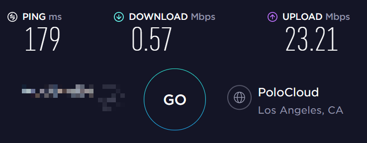
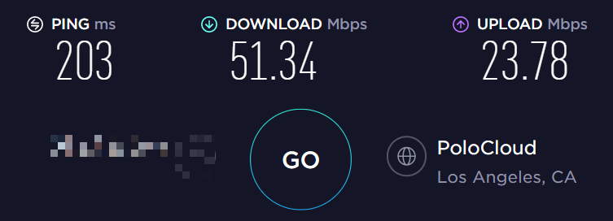

> 去年 7 月看到某个服务器供应商，只要 12.99 丑刀就可以买一年 1 核 1G 的服务器，就买了一年，但最近出问题越来越频繁，客服的回复速度也越来越慢，实在是忍不了。今天又在找廉价的服务器，于是找到了另一家只要 17.99 丑刀就可以买一年同样配置的服务器，所以买了一年。

# 1. 安装 `shadowsocks-libev`

```shell
apt install shadowsocks-libev -y
```

# 2. 配置

这次使用的是 ubuntu 20.04 ，装好 `shadowsocks-libev` 之后 `shadowsocks-libev.service` 就是 running && enabled 的，只需要编辑 `/etc/shadowsocks-libev/config.json`：

```json
{
  "server": ["::1", "0.0.0.0"],
  "mode": "tcp_and_udp",
  "server_port": 8388,
  "local_port": 1080,
  "password": "坚不可摧的密码",
  "timeout": 60,
  "fast_open": false,
  "method": "chacha20-ietf-poly1305"
}
```

- 关闭 `fast_open` 是因为有人发现 google chromiun 移除了 TCP Fast Open 的相关源码，貌似是因为 TCP Fast Open 被 middleboxes 拖慢，并不会真正实现加速
- 密码最好用一个高强度的密码，据说可以缓解针对 `shadowsocks` 的 Partitioning Oracle 攻击，没有头绪的话可以试着用 openssl 生成一个随机密码: `openssl rand -base64 16`

写好了 config 之后记得 restart 一下

```shell
systemctl restart shadowsocks-libev.service
```

# 3. BBR

这时应该就可以用了，测一下速:



延迟倒是不高，但是速度实在是太惨了，这时可以试着启用 BBR，编辑 `/etc/sysctl.conf` ，把这两行加到最后:

```conf
net.core.default_qdisc=fq
net.ipv4.tcp_congestion_control=bbr
```

然后 reload 一下:

```shell
sysctl -p
```

这回再来测速:



好像延迟稍稍高了一点，但还可以接受，而速度已经还算能用了。
