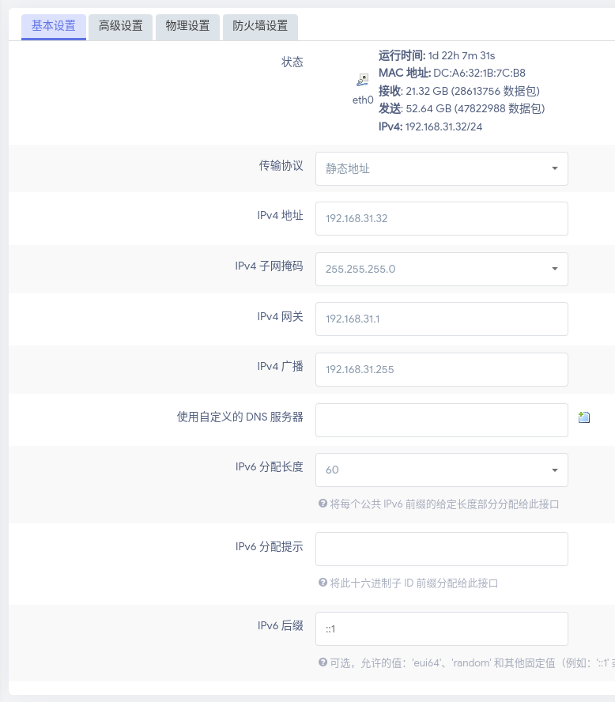
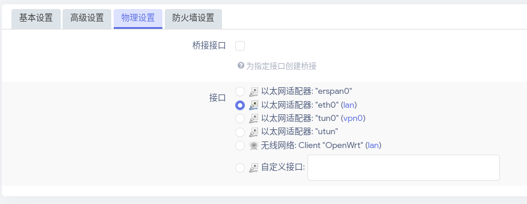
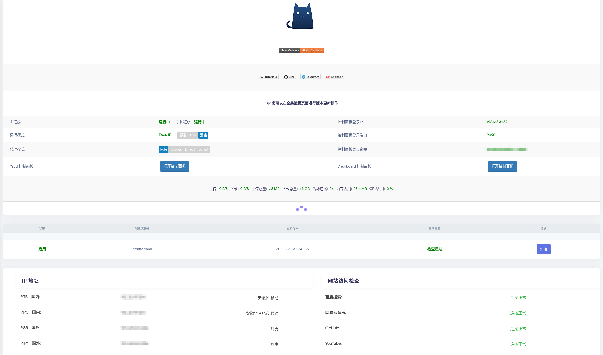
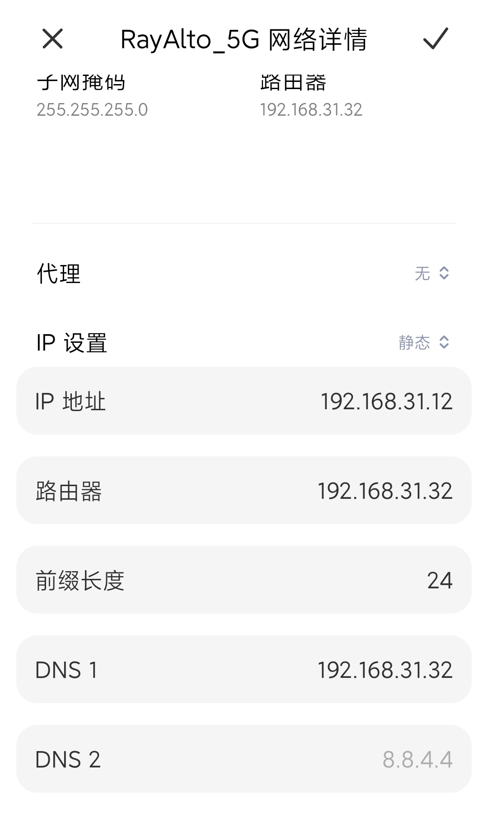
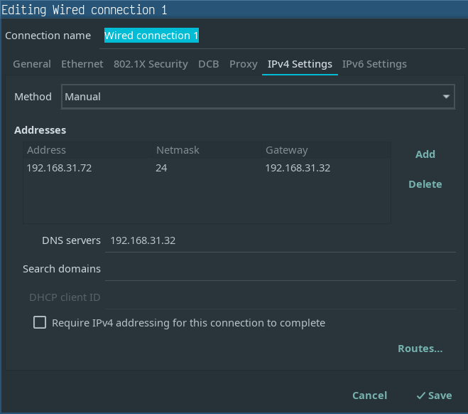

# 透明代理

## 启用包转发 (package forwarding)

```shell
vim /etc/sysctl.d/30-ipforward.conf
```

```conf
net.ipv4.ip_forward=1
net.ipv6.conf.default.forwarding=1
net.ipv6.conf.all.forwarding=1
```

## 允许一般用户开通透明代理

```shell
setcap "cap_net_bind_service=+ep cap_net_admin=+ep" /usr/bin/clash
```

> iptables 什么的实在太难配置了， Clash 的规则也不怎么好写，所以放弃了手动配置。下面记录给 Raspberry Pi 4B 安装 OpenWrt ，用 OpenClash 做网关的方法。

---

## 人生苦短，我选择 OpenWrt + OpenClash

一开始我还在想自己编译 LEDE ，但一些插件总是编译出错，所以我打算用别人编译好的 OpenWrt ，因为我的设备是 Raspberry Pi 4B 所以我选择了[这个版本的 OpenWrt](https://github.com/SuLingGG/OpenWrt-Rpi) 去 Github Actions 里找到对应的版本，按照[这个文档](https://doc.openwrt.cc/1-General/1-Install-Upgrade/)安装好就可以用了。

## 配置 IP 地址

把卡插进树梅派之后不要插网线，因为默认 OpenWrt 会作为主路游启动，也就是说它的 ip 默认是 `192.168.1.1` 有可能会与当前的局域网产生冲突。不插网线开机后搜索 Wifi 应该会有一个没有密码的 SSID 为 'OpenWrt' 的 Wifi ，随便找一个设备连接上这个 Wifi ，打开 [OpenWrt 的管理页面](http://192.168.1.1) 找到 `网络 -> 接口 -> LAN -> 修改 -> 基本设置` ，传输协议改为“静态地址”， IPv4 地址填一个不会产生冲突的地址，比如我用 `192.168.31.32` ，一般的家庭网络环境 IPv4 子网掩码可以选择 `255.255.255.0` ， IPv4 广播可以对应填写，比如我这里填 `192.168.31.255` ， IPv4 网关填主路游的地址，其他的可以不填。然后找到 `物理设置` 取消选择“桥接接口”，下面的接口仙则`以太网适配器:"eth0"`。下面的 DHCP 配置选择“忽略此接口”关掉 DHCP 。





## 配置 OpenClash

> 这个固件默认带了很多插件，基本上我想要的都有了，比如 aria2c 、 frp 、 samba 之类的，而且都是图形化配置，这些优点也是能让我从洁癖的 Arch Linux ARM 换到 OpenWrt 的一大理由。

还是在 OpenWrt 界面找到 `服务 -> OpenClash -> 全局设置` 先点击下面的 `切换页面到 FAKE-IP 模式` 然后运行模式选择 `Fake-IP (TUN-混合)` ，然后进入 `DNS 设置` 打开“ Fake-IP 持久化”和“禁止 Dnsmasq 缓存 DNS”，然后进入 `外部控制` 按照自己的需要修改，比如我修改了管理页面登陆密钥，找到 `服务器与策略组管理` ，打开“一键生成配置文件”，拉到下面的“服务器结点配置”，把自己的服务器填进去，然后应该就能用了，启动 OPENCLASH 之后可以 ssh 进 OpenWrt `curl https://www.google.com` 试试看配置能不能用



## 其他设备

其他设备只需要把默认网关和DNS设置成 OpenWrt 的局域网地址就可以了，比如我这里是 `192.168.31.32` ，然后就可以享受透明代理带来的爽快感了。



